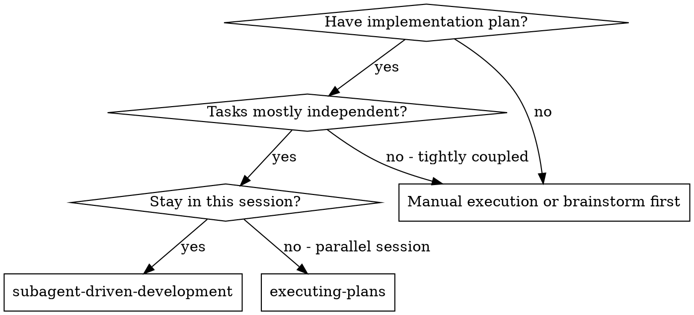

# 프롬프트 전문 — FIVE ALIBIS (nan-alibi)

> NAN 2026 제출물 4번 부록. 사람이 실제로 입력한 것만 시간순으로 담았다.
> 툴 결과 · 시스템 주입 · 서브에이전트 내부 대화 · 컨텍스트 압축 재생은 제외했다.
> 생성: `scripts/export-prompts.py` · 세션 5개


## 세션 1 — 2026-08-03 ~ 2026-08-05

`49e600f2-d6e9-4bf6-b31b-79e73b3281cb.jsonl` · 발화 53건

### 2026-08-03 15:44

```text
https://nan2026.nhn.com/ -> 해커톤이 열리는데 참여할거야.
일단 팀원과 기획하기 앞서서 정보 수집하고 싶은데 서브에이전트 적극적으로 써서 NHN 측에서 원하는 방향, 어떤 식으로 게임을 빌딩해야될지, 및 추가 정보들 수집해줘
```

### 2026-08-03 15:44

```text
[Request interrupted by user]
```

### 2026-08-03 15:44

```text
https://nan2026.nhn.com/ -> 해커톤이 열리는데 참여할거야.
일단 팀원과 기획하기 앞서서 정보 수집하고 싶은데 서브에이전트 적극적으로 써서 NHN 측에서 원하는 방향, 어떤 식으로 게임을 빌딩해야될지, 및 추가 정보들 수집해줘

아래 5개 항목을 모두 제출해야 하며, 하나라도 누락 시 심사 대상에서 제외됩니다.

제출물
제출물	제출 형태	비고
1	플레이 가능한 빌드 및 소스 코드	웹(브라우저 실행) 또는 모바일 앱(APK·테스트 링크) + 전체 소스	GitHub Pages (링크)
2	플레이 동영상	30~60초 플레이 영상	YouTube (링크)
3	게임 소개 및 설명 문서	게임 개요·플레이 방법·실행 방법	PDF
4	AI 활용 기술 문서	AI 도구·프롬프트·활용 내역 정리	PDF
5	팀원 롤 기술서
*개인 참여일 경우 생략	팀원별 역할·담당 영역 정리	PDF
항목별 상세
1. 플레이 가능한 빌드 및 소스 코드 (GitHub)

심사자가 직접 플레이할 수 있는 형태로 제출합니다. 아래 중 한 가지 이상을 제공해 주세요.
웹 빌드: GitHub Pages 등으로 배포하여, 링크 클릭만으로 브라우저에서 바로 플레이
모바일 앱: APK 파일 또는 테스트 배포 링크(예: TestFlight, Google Play 내부 테스트 등)
별도 유료 라이선스 없이 심사자가 실행할 수 있어야 합니다.
보안 상의 이유로 PC 실행 파일(.exe 등) 직접 제출은 받지 않습니다.
게임 전체 소스 코드를 동일 저장소에 포함하고, 커밋 기록을 유지해 주세요.
저장소는 공개(public) 제출을 권장합니다. 부득이 비공개일 경우 심사 계정을 초대해 주세요.
심사 계정: [이메일 삭제]
2. 플레이 동영상 (YouTube)

30~60초 분량으로, 실제 게임 플레이 장면을 중심으로 제작해 주세요.
영상에 AI를 이용한 조작·합성이나 타인 영상의 도용은 불가합니다. 실제 플레이 화면 그대로 담아야 합니다.
공개 또는 일부 공개(링크 공유) 상태로 업로드해 주세요.
3. 게임 소개 및 설명 문서 (PDF)

게임 제목 및 한 줄 소개
게임 방법: 목표·조작·종료 조건 포함
실행 방법: 게임 설치 및 실행 방법
플레이 링크 또는 설치 방법(웹 URL / APK·테스트 링크)
플레이 영상 링크
4. AI 활용 기술 문서 (PDF)

AI 활용에 대한 기술적 설명(예: 구조 설명, AI 대상 주요 프롬프트 및 지시 사항)
외부 에셋 / 오픈소스 출처
5. 팀원 롤 기술서 (PDF)

2인 이상 팀인 경우에만 제출해주세요.

팀원별 이름 / 담당 역할 (기획·개발·아트·AI 활용 등)
각 팀원이 실제로 맡아 구현한 영역
(해당 시) 협업·분업 방식
유의사항
타인의 저작물·아이디어를 무단 도용한 경우, 발생하는 모든 책임은 제출자 본인에게 있으며 선발이 취소될 수 있습니다.
외부 에셋(이미지·사운드 등) 사용 시 출처와 라이선스를 AI 활용 기술 문서에 반드시 명시해야 합니다.
AI 도구 사용은 허용·권장하나, 사용 도구와 활용 내역을 반드시 기재해야 합니다.
제출 링크(GitHub·YouTube)는 심사 종료 시점까지 접근 가능한 상태로 유지해 주세요.
접수 마감 후에는 제출 내용을 변경할 수 없습니다.
개인정보 수집·이용 및 저작권 관련 동의가 제출에 포함됩니다.
```

### 2026-08-03 18:48

```text
AI가 단순히 활용이 되어야되는게 아니라 메인 기능으로 있어야된다는거잖아? 그들이 주제를 낸 이유도 AI 엔지니어를 뽑기 위한거고,

일단 우리 팀은 두명이고 둘다 백엔드적인 지식이 있어.

어필 포인트도 뭔가 컨벤션을 잘 잡고, AI 에이전트를 각자 쓴다는 가정 하에 인간이 병목이 되지않는 협업 방식을 보여줄 수 있으면 좋겠어.

또한 NHN 의 배경과 짧은 시간안에 구현이 될 수 있는 주제 중에 어떤 것들이 눈에 띌 수 있을까?


아이디어 빌딩 기획 도와줘. superpower나 기획 모드가 도움이 될까?
```

### 2026-08-03 18:48  *(붙여넣은 자료 10,391자)*

````text
Base directory for this skill: ~/.claude/plugins/cache/claude-plugins-official/superpowers/6.1.1/skills/brainstorming

# Brainstorming Ideas Into Designs

Help turn ideas into fully formed designs and specs through natural collaborative dialogue.

Start by understanding the current project context, then ask questions one at a time to refine the idea. Once you understand what you're building, present the design and get user approval.

<HARD-GATE>
Do NOT invoke any implementation skill, write any code, scaffold any project, or take any implementation action until you have presented a design and the user has approved it. This applies to EVERY project regardless of perceived simplicity.
</HARD-GATE>

## Anti-Pattern: "This Is Too Simple To Need A Design"

Every project goes through this process. A todo list, a single-function utility, a config change — all of them. "Simple" projects are where unexamined assumptions cause the most wasted work. The design can be short (a few sentences for truly simple projects), but you MUST present it and get approval.

## Checklist

You MUST create a task for each of these items and complete them in order:

1. **Explore project context** — check files, docs, recent commits
2. **Offer the visual companion just-in-time** — NOT upfront. The first time a question would genuinely be clearer shown than described, offer it then (its own message); on approval its browser tab opens for you. If no visual question ever arises, never offer it. See the Visual Companion section below.
3. **Ask clarifying questions** — one at a time, understand purpose/constraints/success criteria
4. **Propose 2-3 approaches** — with trade-offs and your recommendation
5. **Present design** — in sections scaled to their complexity, get user approval after each section
6. **Write design doc** — save to `docs/superpowers/specs/YYYY-MM-DD-<topic>-design.md` and commit
7. **Spec self-review** — quick inline check for placeholders, contradictions, ambiguity, scope (see below)
8. **User reviews written spec** — ask user to review the spec file before proceeding
9. **Transition to implementation** — invoke writing-plans skill to create implementation plan

## Process Flow

```dot
digraph brainstorming {
    "Explore project context" [shape=box];
    "Ask clarifying questions" [shape=box];
    "Propose 2-3 approaches" [shape=box];
    "Present design sections" [shape=box];
    "User approves design?" [shape=diamond];
    "Write design doc" [shape=box];
    "Spec self-review\n(fix inline)" [shape=box];
    "User reviews spec?" [shape=diamond];
    "Invoke writing-plans skill" [shape=doublecircle];

    "Explore project context" -> "Ask clarifying questions";
    "Ask clarifying questions" -> "Propose 2-3 approaches";
    "Propose 2-3 approaches" -> "Present design sections";
    "Present design sections" -> "User approves design?";
    "User approves design?" -> "Present design sections" [label="no, revise"];
    "User approves design?" -> "Write de

…(이하 생략)
````

### 2026-08-03 18:48  *(붙여넣은 자료 10,391자)*

````text
Base directory for this skill: ~/.claude/plugins/cache/claude-plugins-official/superpowers/6.1.1/skills/brainstorming

# Brainstorming Ideas Into Designs

Help turn ideas into fully formed designs and specs through natural collaborative dialogue.

Start by understanding the current project context, then ask questions one at a time to refine the idea. Once you understand what you're building, present the design and get user approval.

<HARD-GATE>
Do NOT invoke any implementation skill, write any code, scaffold any project, or take any implementation action until you have presented a design and the user has approved it. This applies to EVERY project regardless of perceived simplicity.
</HARD-GATE>

## Anti-Pattern: "This Is Too Simple To Need A Design"

Every project goes through this process. A todo list, a single-function utility, a config change — all of them. "Simple" projects are where unexamined assumptions cause the most wasted work. The design can be short (a few sentences for truly simple projects), but you MUST present it and get approval.

## Checklist

You MUST create a task for each of these items and complete them in order:

1. **Explore project context** — check files, docs, recent commits
2. **Offer the visual companion just-in-time** — NOT upfront. The first time a question would genuinely be clearer shown than described, offer it then (its own message); on approval its browser tab opens for you. If no visual question ever arises, never offer it. See the Visual Companion section below.
3. **Ask clarifying questions** — one at a time, understand purpose/constraints/success criteria
4. **Propose 2-3 approaches** — with trade-offs and your recommendation
5. **Present design** — in sections scaled to their complexity, get user approval after each section
6. **Write design doc** — save to `docs/superpowers/specs/YYYY-MM-DD-<topic>-design.md` and commit
7. **Spec self-review** — quick inline check for placeholders, contradictions, ambiguity, scope (see below)
8. **User reviews written spec** — ask user to review the spec file before proceeding
9. **Transition to implementation** — invoke writing-plans skill to create implementation plan

## Process Flow

```dot
digraph brainstorming {
    "Explore project context" [shape=box];
    "Ask clarifying questions" [shape=box];
    "Propose 2-3 approaches" [shape=box];
    "Present design sections" [shape=box];
    "User approves design?" [shape=diamond];
    "Write design doc" [shape=box];
    "Spec self-review\n(fix inline)" [shape=box];
    "User reviews spec?" [shape=diamond];
    "Invoke writing-plans skill" [shape=doublecircle];

    "Explore project context" -> "Ask clarifying questions";
    "Ask clarifying questions" -> "Propose 2-3 approaches";
    "Propose 2-3 approaches" -> "Present design sections";
    "Present design sections" -> "User approves design?";
    "User approves design?" -> "Present design sections" [label="no, revise"];
    "User approves design?" -> "Write de

…(이하 생략)
````

### 2026-08-03 19:12

```text
일단 로그라이크류나 츠무츠무, 슬롯머신 원리의 간단한 짧으면서 도파민 터지는걸로 가고싶어. 그러니까 조금 큰 범위로 개발을 하기보다는 간단하면서 중독성있는거로. 완성도로 승부보는거지 가볍고. 또 뭔가 일본쪽으로 NHN이 나간다고 하니까 거기에 맞추고 싶기도하고
```

### 2026-08-03 19:18

```text
좋아 계속 아이디어 내줘. 10개씩
```

### 2026-08-03 19:28

```text
10개 더 내줘
```

### 2026-08-03 19:50

```text
아니 반대로 AI가 핵심 서비스로 들어간 게임의 레퍼런스가 있나/

 우리 비용처리나 (굳이 상위모델 쓸 필요 없는 부분은 mini로 처리, 게산 및 연산 필요한 부분은 상위 호출, 나머지는 로컬 llm으로 처리) 등 비용 처리와 라우팅 능력 보여줄 수 있는 게임 이런거 없나?
```

### 2026-08-03 20:13  *(붙여넣은 자료 43,029자)*

```text
<task-notification>
<task-id>ad5b42e84607a0a30</task-id>
<tool-use-id>toolu_0193Z6TfbteFz9jhvk2ZrKrp</tool-use-id>
<output-file>/private/tmp/claude-501/-Users-teo-Project-NHN/e1ba1966-28eb-42e5-b21d-6212b6c00aef/tasks/ad5b42e84607a0a30.output</output-file>
<status>completed</status>
<summary>Agent "Parallel AI coding collaboration" finished</summary>
<note>A task-notification fires each time this agent stops with no live background children of its own. The user can send it another message and resume it, so the same task-id may notify more than once.</note>
<result># 2인 팀 × 병렬 AI 코딩 에이전트: 충돌·발산·인간 병목 회피 리서치

**표기 규칙** — 모든 주장 뒤에 출처 URL. 근거 등급을 앞에 붙임:
- **【측정】** 논문·RCT·대규모 텔레메트리 등 실제 측정치
- **【관행】** 여러 벤더/팀이 수렴한 널리 채택된 관행
- **【주장】** 한 회사의 자기 보고·의견 (마케팅 인센티브 있음)
- **【확인 불가】** 1차 출처 확보 실패

---

## 0. 6일 해커톤 2인 팀에 대한 결론 먼저

리서치 전체가 한 방향을 가리킨다: **병렬 에이전트의 병목은 머지 충돌이 아니라 인간 검증 용량이다.** 그리고 그 용량은 사람이 스스로 생각하는 것보다 훨씬 작다.

가장 방어 가능한 6일 세팅:
1. **파일 소유권을 사람 단위로 사전 분할** (에이전트 단위가 아님) — 이게 충돌 방지의 유일한 확실한 수단
2. **인터페이스를 코드보다 먼저 커밋** (OpenAPI/타입 스텁/JSON Schema)
3. **에이전트당 worktree, 태스크당 브랜치, PR 1개** — 업계 수렴 표준
4. **1인당 동시 2~3 에이전트 상한** — 그 이상은 리뷰가 무너짐
5. **CI를 진짜 리뷰어로** — 사람 리뷰는 스펙 대조만
6. **PR 50~200줄 규율** — AI 시대에 오히려 지키기 어려워진 규칙

이 6개 각각에 아래에 측정 근거가 붙는다.

---

## 1. 병렬 에이전트 격리 패턴

### 1.1 업계가 수렴한 3계층 격리

**【관행】** 모든 주요 플랫폼이 동일한 3계층으로 수렴했다:
- **로컬 병렬 = git worktree** (Claude Code, Cursor)
- **클라우드 병렬 = 태스크당 컨테이너/VM** (Codex, Jules, Devin, Copilot)
- **머지백 = 브랜치당 1태스크 + PR** (예외 없음)

**결정적 사실: 어떤 벤더도 병렬 에이전트 출력의 자동 시맨틱 머지를 제공하지 않는다.** 전부 "사람이 N개의 별도 PR을 리뷰한다"에서 끝난다.

### 1.2 플랫폼별 실제 격리 모델

**Claude Code** — 기본 격리 단위는 컨테이너가 아니라 **git worktree**.
- `claude --worktree &lt;name&gt;` → `.claude/worktrees/&lt;name&gt;/`, 브랜치 `worktree-&lt;name&gt;`. 기본 base는 로컬 HEAD가 아니라 **리모트 기본 브랜치**(`worktree.baseRef: "fresh"`) — https://code.claude.com/docs/en/worktrees
- **함정**: worktree는 fresh checkout이라 `.env` 같은 gitignore된 파일이 없다. `.worktreeinclude` 파일로 복사 대상 지정 필요 — https://code.claude.com/docs/en/worktrees
- 서브에이전트 frontmatter에 `isolation: worktree`로 영구 격리 가능. 실행 중 `git worktree lock`이 걸려 동시 정리가 제거하지 못함 — https://code.claude.com/docs/en/worktrees
- **【주장】** Agent teams(실험적, 기본 off)는 **teammate를 worktree로 격리하지 않는다.** 공식 문서의 완화책이 수동 분할이다: *"Two teammates editing the same file leads to overwrites. Break the work so each teammate owns a different set of files."* — https://code.claude.com/docs/en/agent-teams
- **【주장】** 권장 규모: **teammate 3~5명, teammate당 태스크 5~6개.** *"Three focused teammates often outperform five scattered ones."* 하드 리밋 없음 — https://code.claude.com/docs/en/agent-teams
- **【주장】** Dynamic workflows의 하드 캡: **동시 16 에이전트, 런당 총 1,000 에이전트.** 25 에이전트 또는 150만 토큰 초과 시 경고 — https://code.claude.com/docs/en/workflows
- **【주장】** `/batch` 스킬: 큰 변경을 **5~30개 worktree 격리 서브에이전트로 쪼개 각각 PR을 연다** — https://code.claude.com/docs/en/agents
- **【주장】** 비용 배수: agent teams는 단일 세션 대비 **~7배 토큰**; 백그라운드 에이전트 10개는 쿼터를 약 10배 속도로 소모 — https://code.claude.com/docs/en/costs

**Cursor / Anysphere**
- *

…(이하 생략)
```

### 2026-08-04 00:52

```text
* 페르소나를 활용한 미연시 소개팅 시뮬레이션 로그라이크 ( 기획 : 소개팅 시뮬레이션, 페르소나 활용 미연시 게임
   * 가상 소개팅 시뮬레이션.
AI 연애 상대 페르소나를 바탕으로
소개팅을 하는 상황에 중간에 미니게임이 떠서 1위를 못하게 되면 로그라이크처럼 민망한 선택지들일 주어짐.
e.g. 좇끼니진, 여자들이 극혐하는 패션( 좇끼니진, 박진영 비닐바지, 다리털 가득 숏팬츠에 긴 양말에 샌들, 민소매 한장입어 유두 부각, 삼묵컷, 배바지, 베이징 비키니, 깎다 만 수염, 등산복 도배 패션, 빨간 내복, 발가락 양말 등) 참고해 빌드업, 최악의 패션들을 하나씩 장착할 수록 여자의 태도가 굳어지고 그럼에도 불구하고 애프터를 따내는 것이 이 게임의 목표. 각 미니게임은 퀘스트 형식으로 주어짐 ( 여자 몰래 코파기, 데이트 음식 와구와구 먹기 등)
각 최악의 패션 조합은 시너지 효과, 여자와 하는 상호작용은 다음 미니게임에 영향이 있음 e.g. 최악의 대답들을 했을 때 미니게임 패널티
재밌게 기획 짜줘,)
   * 
* 타이핑 로그라이크 (레퍼런스 : typing, break, glyphica typing survival)


이거 일단 모작으로 똑같이 만들어서 돌려보고 괜찮으면 여기다가 AI layer 넣어서 NHN 대회 맞게 만들어보려고.

아이디어 빌딩해주고 막히는 부분이나 명확하지 않은 부분 다시 물어봐줘
```

### 2026-08-04 01:34

```text
일단 기획서 빌딩을 같이 해보고 싶어. 팀원한테 mvp 만들어서 보여줄려고. 그 후에 괜찮으면 다시 처음부터 팀원 에이전트와 빌딩할거야
```

### 2026-08-04 02:15

```text
좋아 이 구조로 가고 미니게임 3종 상세부터 짜줘
```

### 2026-08-04 02:27

```text
45~50%로 완화하고 대화 선택지 설계로 넘어가줘
```

### 2026-08-04 02:30

```text
결과 화면부터 짜주고 기획서 만들어줘
```

### 2026-08-04 04:05

```text
구현 계획 짜줘
```

### 2026-08-04 04:05

```text
[Request interrupted by user]
```

### 2026-08-04 04:05

```text
좋아 근데 이번에 superpower 기획 모드로 짜는거랑 시나리오로 짜는거랑 비교해줄 수 있나? agent scenario 스킬들 있어가지고
```

### 2026-08-04 04:09

```text
3번으로 가줘
```

### 2026-08-04 04:32  *(붙여넣은 자료 7,218자)*

````text
Base directory for this skill: ~/.claude/plugins/cache/claude-plugins-official/superpowers/6.1.1/skills/writing-plans

# Writing Plans

## Overview

Write comprehensive implementation plans assuming the engineer has zero context for our codebase and questionable taste. Document everything they need to know: which files to touch for each task, code, testing, docs they might need to check, how to test it. Give them the whole plan as bite-sized tasks. DRY. YAGNI. TDD. Frequent commits.

Assume they are a skilled developer, but know almost nothing about our toolset or problem domain. Assume they don't know good test design very well.

**Announce at start:** "I'm using the writing-plans skill to create the implementation plan."

**Context:** If working in an isolated worktree, it should have been created via the `superpowers:using-git-worktrees` skill at execution time.

**Save plans to:** `docs/superpowers/plans/YYYY-MM-DD-<feature-name>.md`
- (User preferences for plan location override this default)

## Scope Check

If the spec covers multiple independent subsystems, it should have been broken into sub-project specs during brainstorming. If it wasn't, suggest breaking this into separate plans — one per subsystem. Each plan should produce working, testable software on its own.

## File Structure

Before defining tasks, map out which files will be created or modified and what each one is responsible for. This is where decomposition decisions get locked in.

- Design units with clear boundaries and well-defined interfaces. Each file should have one clear responsibility.
- You reason best about code you can hold in context at once, and your edits are more reliable when files are focused. Prefer smaller, focused files over large ones that do too much.
- Files that change together should live together. Split by responsibility, not by technical layer.
- In existing codebases, follow established patterns. If the codebase uses large files, don't unilaterally restructure - but if a file you're modifying has grown unwieldy, including a split in the plan is reasonable.

This structure informs the task decomposition. Each task should produce self-contained changes that make sense independently.

## Task Right-Sizing

A task is the smallest unit that carries its own test cycle and is worth a
fresh reviewer's gate. When drawing task boundaries: fold setup,
configuration, scaffolding, and documentation steps into the task whose
deliverable needs them; split only where a reviewer could meaningfully
reject one task while approving its neighbor. Each task ends with an
independently testable deliverable.

## Bite-Sized Task Granularity

**Each step is one action (2-5 minutes):**
- "Write the failing test" - step
- "Run it to make sure it fails" - step
- "Implement the minimal code to make the test pass" - step
- "Run the tests and make sure they pass" - step
- "Commit" - step

## Plan Document Header

**Every plan MUST start with this header:**

```markdown
#

…(이하 생략)
````

### 2026-08-04 05:05

```text
서브에이전트 방식으로 진행해줘
```

### 2026-08-04 05:06  *(붙여넣은 자료 21,653자)*

````text
Base directory for this skill: ~/.claude/plugins/cache/claude-plugins-official/superpowers/6.1.1/skills/subagent-driven-development

# Subagent-Driven Development

Execute plan by dispatching a fresh implementer subagent per task, a task review (spec compliance + code quality) after each, and a broad whole-branch review at the end.

**Why subagents:** You delegate tasks to specialized agents with isolated context. By precisely crafting their instructions and context, you ensure they stay focused and succeed at their task. They should never inherit your session's context or history — you construct exactly what they need. This also preserves your own context for coordination work.

**Core principle:** Fresh subagent per task + task review (spec + quality) + broad final review = high quality, fast iteration

**Narration:** between tool calls, narrate at most one short line — the
ledger and the tool results carry the record.

**Continuous execution:** Do not pause to check in with your human partner between tasks. Execute all tasks from the plan without stopping. The only reasons to stop are: BLOCKED status you cannot resolve, ambiguity that genuinely prevents progress, or all tasks complete. "Should I continue?" prompts and progress summaries waste their time — they asked you to execute the plan, so execute it.

## When to Use



**vs. Executing Plans (parallel session):**
- Same session (no context switch)
- Fresh subagent per task (no context pollution)
- Review after each task (spec compliance + code quality), broad review at the end
- Faster iteration (no human-in-loop between tasks)

## The Process

```dot
digraph process {
    rankdir=TB;

    subgraph cluster_per_task {
        label="Per Task";
        "Dispatch implementer subagent (./implementer-prompt.md)" [shape=box];
        "Implementer subagent asks questions?" [shape=diamond];
        "Answer questions, provide context" [shape=box];
        "Implementer subagent implements, tests, commits, self-reviews" [shape=box];
        "Write diff file, dispatch task reviewer subagent (./task-reviewer-prompt.md)" [shape=box];
        "Task reviewer reports spec ✅ and quality approve

…(이하 생략)
````

### 2026-08-04 11:47

```text
게임 2도 IME 스파이크부터 같은 파이프라인으로 돌려줘
```

### 2026-08-05 00:47

```text
6개 다 통과했어
```

### 2026-08-05 02:27

```text
일단 기록해놓고, UI 및 게임 디자인 먼저 완성하자. 필요한 스킬이나 툴 검색해서 먼저 리스트업한 다음에 루프, goal 기능 이용해 완수하자 서브에이전트 적극적으로 활용해줘. fable5 같은 모델은 필요할 때 써
```

### 2026-08-05 03:01  *(붙여넣은 자료 17,876자)*

```text
This session is being continued from a previous conversation that ran out of context. The summary below covers the earlier portion of the conversation.

Summary:
# 1. Primary Request and Intent

The user is entering **NAN 2026 (Next AI Network) — NHN Game × AI Hackathon**. Their requests, in order:

1. **Research** the hackathon aggressively with subagents — what NHN wants, how to build the game, plus extra info. They pasted the full submission requirements.
2. **Idea building** for the pre-submission entry, with two stated appeal points: (a) good conventions, (b) a collaboration method where "인간이 병목이 되지 않는" when both teammates run AI agents. Team = 2 people, both backend, both full-time.
3. Wanted **10 ideas at a time**, twice.
4. Pivoted to asking for **references of games where AI is a core service**, and specifically games that could showcase **cost handling and model routing** (mini for cheap parts, frontier for computation, local LLM for the rest).
5. Redirected to **short, addictive, dopamine-heavy** games (로그라이크 / 츠무츠무 / 슬롯머신 원리), winning on polish rather than scope, with Japanese-market fit.
6. Supplied **two concrete game ideas**: (1) 소개팅 미연시 로그라이크 with worst-fashion buildup + minigames, (2) 타이핑 로그라이크 (refs: Glyphica Typing Survival). Plan: build a clone first, then add the AI layer.
7. Wanted **both games built in parallel**, in separate local repos, each carrying the core philosophy folder.
8. Then narrowed: **build the spec together first**, make an MVP to show the teammate, and if good, rebuild from scratch with the teammate's agent.
9. Asked to compare **superpowers planning mode vs "scenario" skills** (they believed agent scenario skills existed).
10. Chose the **hybrid**: superpowers pipeline + borrowed adversarial verification.
11. Chose **subagent-driven development** for execution.
12. Asked to **run game 2 through the same pipeline starting from the IME spike**.
13. Confirmed **all 6 IME manual checks passed**.
14. **Most recent request:** "일단 기록해놓고, UI 및 게임 디자인 먼저 완성하자. 필요한 스킬이나 툴 검색해서 먼저 리스트업한 다음에 루프, goal 기능 이용해 완수하자 서브에이전트 적극적으로 활용해줘. fable5 같은 모델은 필요할 때 써" — record the balance finding, defer it, complete UI + game design first, list up skills/tools first, use loop/goal, use subagents aggressively, use fable5 when needed.

**Deadline:** 2026-08-10 23:59 (currently 2026-08-05, D-5). Kill decision between the two games was set for 8/6.

# 2. Key Technical Concepts

- **Superpowers skills:** `brainstorming` → `writing-plans` → `subagent-driven-development` (implementer + reviewer per task, ledger-based progress tracking)
- **Adversarial verification:** Architect (steelman) / Critic (spec completeness) / Pre-mortem (failure scenarios) — caught 3 fatal design flaws in game 1
- **Balance checksum tables** verified by independent recompute (reviewer writes arithmetic that imports zero project code)
- **Discrete reduction:** LLM proposes, code validates. LLM never sets numbers/win conditions
- Vite 6 + TypeScript 5 + Vitest 2 + h

…(이하 생략)
```

### 2026-08-05 07:32

```text
응 스크린샷 먼저 찍고 T0, T1 진행해줘
```

### 2026-08-05 08:23

```text
T2, T3, T4 계속 진행해줘
```

### 2026-08-05 09:04

```text
<task-notification>
<task-id>a5e61a2be37161bfc</task-id>
<tool-use-id>toolu_01L5PMM6DmJCR5ip7JhUchrt</tool-use-id>
<output-file>/private/tmp/claude-501/-Users-teo-Project-NHN/e1ba1966-28eb-42e5-b21d-6212b6c00aef/tasks/a5e61a2be37161bfc.output</output-file>
<status>completed</status>
<summary>Agent "T4: three 도입·지연로드" finished</summary>
<note>A task-notification fires each time this agent stops with no live background children of its own. The user can send it another message and resume it, so the same task-id may notify more than once.</note>
<result>T4 is complete and committed. Full report is at `~/Project/nan-typing/.superpowers/sdd/t4-report.md`. Summary:

**상태:** 완료 (three 도입·지연 로드·청크 분리). 기하 0줄, 화면 픽셀 변화 0 — dev 서버(5180)에서 스크린샷 대조로 확인.

**커밋 해시:** `a2e1dc5` — `feat(build): install three, lazy-load an empty FieldRenderer stub, split it into its own chunk`

**테스트 수:** 325 → 325 (17 파일). `fieldGl.ts`를 직접 import하는 테스트 0개 — 전부 동적 import 뒤.

**★ 번들 게이트 실측:**
| 게이트 | 기준 | 실측 | 판정 |
|---|---|---|---|
| 엔트리(main) gz | ≤12,000 B | **14,387 B** | ✗ 미달 |
| three 청크 gz | ≤160,000 B | **9,071 B** | ✓ (17배 여유) |
| JS 총합 gz | ≤175,000 B | **28,172 B** | ✓ (6배 여유) |

**계획서 예측(131KB)과의 차이:** 실측 9,071B는 예측의 약 7%뿐. `fieldGl.ts`가 `WebGLRenderer`를 참조만 하고 인스턴스화하지 않아(계약대로 "기하 없음"), Rollup+Terser가 셰이더 청크 라이브러리 전체를 tree-shake로 제거했기 때문. 실제 131KB 무게는 T5가 `new WebGLRenderer(...)`를 처음 호출할 때 나타난다.

**우려사항 (report §8에 상세):**
1. **엔트리 게이트 미달**은 대부분 T4 이전부터 있던 값이다 — `git checkout`으로 역추적한 결과 T1 착수 전 커밋(`c751125`)에서 이미 main gz 13,310B였고, 지시문의 "현재 8,522B"는 이미 그 시점부터 사실이 아니었다. T4가 실제로 보탠 건 +663B(대부분 Vite의 최초 동적-import 헬퍼 고정비)뿐. three가 메인에 인라인되는 실제 위험(8.5KB→130KB)은 일어나지 않았다.
2. **`@types/three`가 필요했다** — 설치된 `three@0.185.1`에 `.d.ts`가 0개라 "자체 타입 제공, 불필요" 전제가 틀렸다. devDependency로 추가함(런타임 번들엔 영향 없음).
3. T5가 실제 `WebGLRenderer`를 canvas#field에 붙일 때, 그 canvas가 이미 2D 컨텍스트를 쥐고 있어 컨텍스트 획득이 즉시 실패할 것 — 계획서가 이미 인지한 함정(§5②)이지만 실측으로 재확인.</result>
<usage><subagent_tokens>175708</subagent_tokens><tool_uses>70</tool_uses><duration_ms>990200</duration_ms></usage>
</task-notification>
```

### 2026-08-05 09:09  *(붙여넣은 자료 3,660자)*

```text
<task-notification>
<task-id>af8be74fb43b48004</task-id>
<tool-use-id>toolu_01Lf7zhBpKXj6VURMoivWWS4</tool-use-id>
<output-file>/private/tmp/claude-501/-Users-teo-Project-NHN/e1ba1966-28eb-42e5-b21d-6212b6c00aef/tasks/af8be74fb43b48004.output</output-file>
<status>completed</status>
<summary>Agent "결함 소탕: 도형·채움·죽은조건" finished</summary>
<note>A task-notification fires each time this agent stops with no live background children of its own. The user can send it another message and resume it, so the same task-id may notify more than once.</note>
<result>**상태: 완료.** `feat/defects` · `npx tsc --noEmit` 통과 · **333 테스트 전부 통과** (325 + 신규 8). `npm run dev`는 안 띄웠다.

**커밋:** `c21f3a1` (코드·테스트·UI.md) → `b833a80` (D-005 + 주석 감량). 보고서 전문은 `~/Project/nan-typing-def/.superpowers/sdd/defect-sweep-report.md` (상위 저장소가 `.superpowers/`를 추적하지 않아 커밋엔 안 넣었다).

## 결함 3건 처리

**① 면적 불일치 → 원 기준으로 정규화.** `r_shape = r × √(π/unitArea)` → ▲ ×1.5551 / ● ×1 / ■ ×0.8862, `src/data/fieldVisual.ts`의 `SHAPE_AREA_SCALE`. **기준을 원으로 잡은 근거 3가지:** (1) `r`이 외접/내접 같은 관례 선택 없이 정의되는 유일한 도형이다 (2) UI.md §5.2의 `13px/20px`이 WATER에서 글자 그대로 산다 (3) UI.md §5.4의 보스 `r=46`이 안 움직인다(유일한 보스 웨이브 W6이 WATER다). 버린 대안: 기하평균 기준 — 세 원소 전부 문서 px에서 벗어나고 선택 자체가 더 임의적이다. 보스는 정규화 대상에서 뺐다(크기가 maxHp를 안 뜻한다).
**①덤:** **UI.md를 정본으로** 정삼각형 `(x,y−r)·(x±r√3/2, y+r/2)`로 고쳤다 — 무게중심이 이제 정확히 중심이라 FIRE의 판정/보이는 위치 어긋남이 사라졌다.

**② 채움 비선형 → 면적→높이 역함수** (`fillHeightRatio`). ▲ `u=1−√(1−a)`, ● 활꼴 면적 수치 역함수(이분법 40회), ■ `u=a`. **원도 비선형이었다**(높이 25% = 면적 19.6%) — 같이 고쳤다. 사각형만 원래 선형. 변환은 `buildFieldFrame`이 하고 `MobDraw.fillHeightRatio`로 실어 보낸다(T1의 판정/그리기 경계 유지, 향후 GL 백엔드도 같은 값을 쓸 수 있다).

**③ → (a) 조건을 살렸다.** `OUTLINE_W.staticDanger = 3.5` 신설, 우선순위 `staticDanger &gt; (lit||crossed) &gt; 평시`. **§5.3.4는 색을 한 글자도 언급하지 않는다** — 브리프의 「원소색이 아니라 ALARM」 전제는 성립하지 않고, 죽어 있던 건 **굵기** 채널이다. 2.5는 `crossed`가 이미 주던 값이라 reduced-motion 사용자는 점멸을 잃고 **대체물을 하나도 못 받고 있었다.** 의도(정지한 대체 신호)를 살리고 숫자만 고친 뒤 **UI.md §5.3.4를 정정**했다(정정 사유를 인용 블록으로 문서에 박음). (b)를 버린 이유: HUD 타이머가 있긴 하나, 이 프로젝트는 AREA 링에서 이미 「reduced-motion이어도 정보는 안 잃는다」를 관철했고 급소 #1에서만 포기할 근거가 없다.

## 뮤테이션 — 9종 전부 사망
M1 계수 제거 →1 / M2 기준을 기하평균으로(면적 균등은 유지) →1 / M3 이등변삼각형 복귀(면적 유지) →1 / M4 렌더러가 `fillRatio`를 높이로 →2 / M5 삼각형 역함수 선형화 →2 / M6 원 역함수 선형화 →2 / **M7 `staticOutline` 항 제거(T1에서 325개를 통과시키며 생존했던 그 뮤테이션) →3** / M8 `staticDanger` 3.5→2.5 →3 / M9 `lit &gt; staticDanger` 우선순위 뒤집기 →1.
M2·M3는 면적이 균등한 채로도 각각 다른 단언 **하나씩만** 죽였다 — 세 단언이 독립적으로 다른 결정을 잠근다는 증거다. 테스트는 계수표를 베끼지 않는다: 실제 렌더러가 그린 캔버스 경로를 가로채 **신발끈 공식 + 1000² 격자 적분**으로 면적을 직접 잰다.

## 기대값을 바꾼 기존 테스트 — 1개
`tests/ui/field.test.ts` reduced-motion 굵기 `2.5 → 3.5`(제목 포함). **근거:** 옛 2.5는 `crossed`가 이미 주던 값이라 참이면서도 아무것도 안 잠갔다(T1이 실증). 3.5는 crossed와 구분되므로 이제 실제로 문다(M7·M8). 비-reduced가 2.5임을 확인하는 대조군 한 줄을 추가했다. 나머지 324개는 무수정 통과.

## 우려사항
1. **★ FIRE의 바운딩 박스가 커진다** — 면적은 같아도 삼각형 외접원이 ×1.5551이라 W5(11기)에서 밑변 49px. 후반 겹침이 늘 수 있다. 화면을 못 봤다. 역효과가 나면 다음 손잡이는 도형 축소가 아니라 ASSETS.md §3.5③의 **타원형 스폰 반지름**이다(좌우 175px 낭비가 겹침의 진짜 원인).
2. **면적 균등 ≠ 지각 균등** — 뾰족한 도형은 같은 면적에도 커 보

…(이하 생략)
```

### 2026-08-05 09:21  *(붙여넣은 자료 3,269자)*

````text
<task-notification>
<task-id>a3041593622d993ce</task-id>
<tool-use-id>toolu_01SUCWLyZTHfYbrkZDJJUk1o</tool-use-id>
<output-file>/private/tmp/claude-501/-Users-teo-Project-NHN/e1ba1966-28eb-42e5-b21d-6212b6c00aef/tasks/a3041593622d993ce.output</output-file>
<status>completed</status>
<summary>Agent "T5: GL 골격" finished</summary>
<note>A task-notification fires each time this agent stops with no live background children of its own. The user can send it another message and resume it, so the same task-id may notify more than once.</note>
<result>**상태: 완료.** 커밋 `b8969ce` (feat/mvp). 전체 보고서는 `~/Project/nan-typing/.superpowers/sdd/t5-report.md` (`.superpowers`가 gitignore라 커밋엔 안 들어감).

**테스트: 343 → 359 (+16, 깨진 것 0).** `npx tsc --noEmit` clean.

### ★ 2D/WebGL 컨텍스트 충돌을 어떻게 풀었나

**순서를 뒤집었다 — 컨텍스트 획득을 렌더러 선택의 *결과*로 만들었다.**

```ts
// battleStage.ts
const deferredGl = ctxOverride == null &amp;&amp; rendererOverride == null &amp;&amp; prefersGlRenderer()
  ? createDeferredRenderer() : null
const ctx = ctxOverride ?? (deferredGl ? null : readCtx(canvas))  // ★ GL이면 2D를 아예 안 잡는다
const renderer = rendererOverride ?? deferredGl?.renderer
```

- **캔버스는 하나 그대로.** `new WebGLRenderer({ canvas: canvas#field, ... })` — three가 자기 캔버스를 안 만든다.
- **`readCtx()`는 한 글자도 안 고쳤다.** 넓어진 건 `field`가 null이 되는 *조건*뿐 — 「ctx가 없으면」 → 「그릴 수단이(ctx도 렌더러도) 없으면」. 헤드리스는 예전 그대로 null을 본다. (`createField`가 `ctx: Ctx2D | null`을 받도록 넓혔고, 둘 다 없으면 던진다.)
- **동적 import 시차는 자리표시자 렌더러로 메웠다** (`createDeferredRenderer`) — 도착 전엔 no-op, 도착하면 **마지막 resize를 재생**, destroy 후 도착하면 즉시 dispose. 덕분에 `BattleStage.field`가 동기적으로 확정돼서 **`battle.ts`의 `field?.render` 한 줄을 안 건드렸다.**
- 기본은 계속 Canvas 2D. GL 실패 시 폴백은 넣지 않았다(T11 선점 방지) — no-op으로 남는다.

**dev 서버(5180, 이미 떠 있던 것에 접속만) 실측:** `?renderer=gl`에서 캔버스 1개(`id=field`), `getContext('webgl2')` 살아 있음, **`getContext('2d')`는 null**(= 순서 뒤집기가 실제로 작동), 인라인 style `null`(`setSize(...,false)` 확인), viewport `[0,0,132,990]`(= CSS 66×495 × dpr 2 → ScaleSink 배선 도달), `readPixels` `[0,0,0,0]`(알파 0 클리어 → CSS `--ink-900`이 비침), 콘솔 에러 0. 기본 경로와 캔버스 크기·백킹 스토어가 **완전히 동일** → `.fx-layer` 짝 안전.

### 번들 게이트 3줄 (실측)

| 게이트 | 기준 | 실측 | |
|---|---|---|---|
| 엔트리(main) gz | ≤ 15,000 | **14,823** | ✓ (여유 **177 B**) |
| three 청크 gz | ≤ 160,000 | **125,062** | ✓ |
| JS 총합 gz | ≤ 175,000 | **145,099** | ✓ |

T4가 예고한 대로 three가 **9,071 → 125,062 B (13.8배)** 로 나타났다 — 계획서 예측(130,972)보다 5,910 B 가볍다. main은 +436 B.

### 우려사항

1. **엔트리 게이트 여유가 177 B뿐.** T11이 선택 로직을 채우면 거의 확실히 넘는다. main의 무게는 T1 이전부터의 기존 코드(HUD·사전·연출)이고 T5 몫은 436 B — **상한 재조정이든 main 다이어트든 T11 전에 결정이 필요하다.**
2. **GL 실패 시 폴백 없음(의도적).** `?renderer=gl`은 아직 개발자용 스위치.
3. **백킹 스토어를 두 곳이 쓴다(무해).** GL 경로에서 canvasScale의 2D 싱크가 `canvas.width`를 먼저 쓰고 three의 `setSize`가 덮는다. 최종값은 정확하지만 분수 DPR(1.5 등)에선 `round` vs `floor`가 1px 어긋나 리사이즈마다 버퍼가 두 번 재할당된다. `canvasScale.ts`(T3 산출물)는 지시 범위 밖이라 안 건드렸다 — 고치면 「2D ctx 없으면 2D 싱크 생략」 한 줄.
4. **캔버스 CSS 크기 변화를 window resize로만 감지**(실측에서 CSS 528 vs 백킹 495×2). **2D 경로와 값이 같아 T5의 회귀가 아니라 기존 동작이다** — `ResizeObserver`가 답이지만 

…(이하 생략)
````

### 2026-08-05 09:40  *(붙여넣은 자료 3,847자)*

````text
<task-notification>
<task-id>a70b730afef571307</task-id>
<tool-use-id>toolu_011D76LJn6AuGDAHTZ1999Vx</tool-use-id>
<output-file>/private/tmp/claude-501/-Users-teo-Project-NHN/e1ba1966-28eb-42e5-b21d-6212b6c00aef/tasks/a70b730afef571307.output</output-file>
<status>completed</status>
<summary>Agent "T6: 도형 메시 + unlit 색" finished</summary>
<note>A task-notification fires each time this agent stops with no live background children of its own. The user can send it another message and resume it, so the same task-id may notify more than once.</note>
<result>**상태: 완료.** 커밋 `6f0d5f7` (브랜치 `feat/t6`) · 전체 보고서 `~/Project/nan-typing-t6/.superpowers/sdd/t6-report.md`

**테스트: 367 → 379 (+12, 깨진 것 0).** `npx tsc --noEmit` clean. 파일당 300행 준수(fieldGl 275 / glShapes 159 / glColorProbe 95). `npm run dev`는 안 띄웠다.

## ★ 색 바이트 동일성 — 확인 절차

**먼저 알아야 할 함정:** `WebGLRenderer` 기본이 `premultipliedAlpha: true`다. 잡몹은 거리 알파 0.72~1.0을 쓰므로 **화면에서 읽은 바이트는 `색 × 알파`**다 — 알파가 정확히 1인 픽셀에서만 비교가 성립하고, 그건 사실상 보스(W6, WATER)뿐이다. 그래서 "화면 아무 데나 찍기"는 원리적으로 불가능하다.

대신 프로브를 심었다. `?renderer=gl`로 연 뒤 콘솔에서:

```js
__fieldColorProbe()
// { ok: true, rows: [
//   { element:'FIRE',  expected:'#FF7A45', actual:'#ff7a45', bytes:[255,122, 69,255], ok:true },
//   { element:'WATER', expected:'#4AA8FF', actual:'#4aa8ff', bytes:[ 74,168,255,255], ok:true },
//   { element:'WOOD',  expected:'#C8E45C', actual:'#c8e45c', bytes:[200,228, 92,255], ok:true } ] }
```

같은 renderer·같은 `MeshBasicMaterial` 설정·같은 `ELEMENT_COLOR` 문자열로 `opacity=1` 전면 사각형을 그려 `readPixels`한다. `?renderer=gl` 경로에만 붙고 `dispose()`가 지운다. 캔버스가 한 프레임 덮이지만 다음 프레임이 바로 복구한다.

**미리 잰 것:** three 0.185.1의 실제 `Color`와 실제 셰이더 근사식(0.41666)으로 sRGB→linear→**float32**→sRGB→8bit 왕복을 Node에서 돌렸다 — FIRE/WATER/WOOD/`#EDE8DE` 넷 다 **항등**. 남은 미지수는 GPU float 정밀도와 UNORM 반올림뿐이고 그게 위 프로브가 보는 부분이다. 씬에 `Light` 문자열이 0회 등장한다. 머티리얼에 `toneMapped: false`를 추가로 걸어 두 번째 자물쇠를 뒀다.

## 번들 게이트 — ★ 엔트리 초과, 원인은 T6이 아니다
```
main-BMWErOS1.js   gz= 15,195   ← 엔트리 (≤15,000)  ✗
three-Dzstw71G.js  gz=132,249   ← three (≤160,000)  ✓
JS 총합            gz=153,653   (≤175,000)          ✓
```
`git stash`로 이 워크트리 HEAD(`7979823` = `feat/defects` 머지)를 그대로 빌드하니 **엔트리가 이미 15,187 B**였다. **T6이 보탠 건 +8 B.** T5의 14,823은 `feat/defects` 머지 이전 값이고, 그 머지가 `SHAPE_AREA_SCALE`·`fillHeightRatio`·`OUTLINE_W`와 근거 주석으로 **+364 B**를 넣으면서 T5가 경고한 여유 177 B를 소진했다. **상한은 임의로 안 올렸다** — 판단 재료는 보고서 §6.1에 있다(T7·T8·T10은 `fieldGl.ts`만 건드려 엔트리에 거의 영향 없음, T11은 확실히 더 늘어남).

## SHAPE_AREA_SCALE·정삼각형
- **계수를 다시 곱하지 않는 것**이 반영이다. `enemyPositions()`가 이미 `r: mobRadius(maxHp) * SHAPE_AREA_SCALE[shape]`로 반지름에 발라 놨으므로 `MobDraw.r`은 정규화가 끝난 값이다. 지오메트리에서 또 곱하면 면적이 **계수의 제곱**만큼 어긋난다(FIRE가 WOOD의 약 3배). 지켜야 할 계약은 「외접원 반지름 1 기준 실루엣이 `shapePath()`와 동일할 것」 하나로 좁혔다.
- 테스트가 표를 안 베끼고 잠근다: 지오메트리 삼각형을 신발끈으로 적분한 면적 × 계수²가 세 도형에서 같은지 본다(원만 64분할이라 −0.08%). 짝 테스트로 동어반복이 아님도 증명.
- 삼각형은 `(0,1)`·`(±√3/2,−1/2)` — `field2d`의 `(x,y−r)`·`(x±r√3/2, y+r/2)`를 y만 뒤집은 것(`world = (x−w/2, h/2−y)`). 무게중심이 원점. 실루엣 테스트는 **실제 `createField2DRenderer`를 기록용 ctx로 돌려** `shapePa

…(이하 생략)
````

### 2026-08-05 09:59  *(붙여넣은 자료 3,973자)*

```text
<task-notification>
<task-id>aaf5ff6c44db1fb37</task-id>
<tool-use-id>toolu_01DWqZgxCgRW1PgSo6HGh3TW</tool-use-id>
<output-file>/private/tmp/claude-501/-Users-teo-Project-NHN/e1ba1966-28eb-42e5-b21d-6212b6c00aef/tasks/aaf5ff6c44db1fb37.output</output-file>
<status>completed</status>
<summary>Agent "T9: 보스 텍스트 DOM 승격" finished</summary>
<note>A task-notification fires each time this agent stops with no live background children of its own. The user can send it another message and resume it, so the same task-id may notify more than once.</note>
<result>T9 is complete and committed.

**Status:** done. `npx tsc --noEmit` clean, `npm test` → **390/390 passing** (379 pre-existing + 11 new, 0 broken). Commit hash `70c068c861bf2d548cad1f1ee27c402ee34c0de7` on `feat/t9`. Full report at `.superpowers/sdd/t9-report.md`.

**How the 3 traps were guarded:**
1. **`inset` mismatch → center offset (areaRing.ts trap ② reproduction):** `.field-overlay` uses the byte-identical `inset: 0 0 var(--input-h) 0` as `.fx-layer` in `src/style.css`, with a comment explaining why they must match. Locked by a test in `tests/ui/fieldOverlay.test.ts` that parses `style.css` as text and diffs the two `inset` values directly, so a future edit that lets them drift fails CI rather than relying on the comment alone.
2. **`pointer-events: none` omission → input focus theft:** set both inline (`el.style.pointerEvents = 'none'`) in `src/ui/fieldOverlay.ts` and in the CSS rule — the same double-lock pattern `.fx-layer` already uses. Asserted by a dedicated test.
3. **Shake decoupling:** `overlay.update(boss, shakeX, shakeY)` reads `FieldFrame.shakeX/Y` (the same values `ctx.translate` uses on canvas) and applies `transform: translate()` to the overlay container, so the boss bar shakes in sync with the battlefield instead of standing still.

**Architecture note:** rather than wrapping the renderer in `battleStage.ts` (which can't reach the renderer instance `field.ts` builds internally for the default Canvas-2D path), I added a 5th optional parameter `onFrame?: (frame: FieldFrame) =&gt; void` to `createField()` in `src/ui/field.ts`. `buildFieldFrame()` is still called in exactly one place; the same `FieldFrame` instance is handed to both the canvas renderer and the DOM overlay, so judgment (`BossDraw`) can't drift between the two.

**Existing tests:** none needed expected-value changes. `tests/ui/field.test.ts`'s `hpBar`/`hpText`/`reachText` assertions target `buildFieldFrame()`, which is untouched. The canvas-call recorders in `tests/ui/fieldVisual.test.ts` and `tests/ui/glShapes.test.ts` only capture `fillRect` calls immediately following `clip()`/`fill()`; the removed boss HP-bar `fillRect` calls were never preceded by `clip()`, so removing them didn't change recorded output (confirmed empirically — full suite green).

**Untouched as instructed:** `src/ui/fieldGl.ts`, `src/ui/glShapes.ts` (not even read), `src/ui/areaRing.ts`, `src/engine/`, `src/data/`, `src/scenes/battle.ts` (the `fx.

…(이하 생략)
```

### 2026-08-05 10:11

```text
<task-notification>
<task-id>a70375c71a754e245</task-id>
<tool-use-id>toolu_0132RUvykaSWskUrkT8DiBVo</tool-use-id>
<output-file>/private/tmp/claude-501/-Users-teo-Project-NHN/e1ba1966-28eb-42e5-b21d-6212b6c00aef/tasks/a70375c71a754e245.output</output-file>
<status>completed</status>
<summary>Agent "T7+T8: 윤곽선 + HP 채움" finished</summary>
<note>A task-notification fires each time this agent stops with no live background children of its own. The user can send it another message and resume it, so the same task-id may notify more than once.</note>
<result>Done. Everything committed and verified.

## 상태: 완료

**커밋** `a2c5e2d` (feat/mvp) — 코드 + 테스트 + `docs/DECISIONS.md` D-007
**테스트 379 → 408** (+29, 깨진 것 0) · `tsc --noEmit` clean · 파일당 300행 준수
**보고서** `.superpowers/sdd/t78-report.md` (이 디렉토리는 gitignore라 커밋 안 됨 — 이전 태스크들과 동일)

### ★ 반드시 알아야 할 판단 하나
**hull을 솔리드로 만들면 안 됐다 — 고리(annulus)로 만들었다.** 계획서 §2.1은 「크게 스케일해서 뒤에」인데, 그건 「앞 메시가 가운데를 불투명하게 덮는다」는 전제 위에 있고 이 게임은 그게 두 군데서 깨진다: ① T8이 채움을 잘라내면 **빈 위쪽이 윤곽색 솔리드로 꽉 찬다**(A3가 T8 이전에 윤곽 쪽에서 먼저 죽는다) ② 잡몹 알파 0.72~1.0이라 **개체 내부 전체가 윤곽색으로 물든다**(lit/crossed일 때 도형이 통째로 희거나 붉어져 A1까지 삼킨다). 근거·버린 대안은 D-007.

굵기는 **컨투어에서 유도한 마이터 오프셋**이다. 외접원 방향으로만 밀면 정삼각형 변 두께가 `0.5d`가 되어 **FIRE만 윤곽이 절반**이 된다.

### ★ 네가 브라우저에서 확인할 절차 (내가 이미 돌렸다 — 실측값 포함)
`?renderer=gl` → 콘솔. **5180은 안 띄웠다** — 이미 돌고 있던 그 서버에 새 탭으로 붙어 재고 탭을 닫았다.

1. `__fieldOutlineProbe()` → **`ok: true`, 12행 실측 완료.** CIRCLE/SQUARE는 1.500/2.000/2.500/3.500, TRI는 +0.002. 픽셀을 세지 않고 **커버리지를 적분**해서 잰다(세면 AA 때문에 1.5와 2.5를 못 가른다).
2. `__fieldFillProbe(0.4)` → **`ok: true`.** 채움 윗면이 `fillClipY`와 ≤0.2px 일치, 그 위 **21~22 CSS px가 완전히 비어 있고** 윤곽은 온전. TRI의 `heightRatio 0.225`가 면적→높이 역함수가 산 증거다. ★ `measuredFillTop`만 보면 안 된다 — **솔리드 hull 실수는 그걸 통과하면서 `emptyPx`에서만 걸린다.**
3. `__fieldLastFrame().every(m =&gt; m.outlineWidth === 3.5)` — DevTools에서 reduced-motion 에뮬레이트 후 W1 마지막 3초. 이건 게임 상태가 필요해서 네 몫이다. ①이 「굵기 W = 화면 W px」를 증명했으므로 사슬은 닫힌다.

### 번들 게이트 — 전부 통과
`WebGLRenderer` in entry = **0** / 엔트리 gz **15,246** (≤16,000) / three 청크 **132,281** (≤160,000) / 총합 **155,747** (≤175,000). 증가분은 전부 `fieldGl` 청크(1,617→3,721)이고 그중 ~1.1KB가 프로브다.

### 우려사항 3개
- **(a) A/B diff에서 최대 1.75px 차이가 난다.** Canvas `stroke()`는 경로 **중심**에 W/2씩 안팎, 고리는 **바깥으로만** W. 안쪽으로 파고들면 채움과 겹쳐 반투명 잡몹에서 알파 합성이 그리는 순서에 의존하게 되어(오늘은 stroke가 fill 위, GL은 hull이 fill 뒤) 겹침 0을 택했다. 되돌리려면 `glOutline.ts` `update()` 두 줄. **T12 판단 항목.**
- **(b) GPU 한 대에서만 확인했다.** 다만 `linewidth`를 안 쓰므로 드라이버가 굵기를 무시하는 경로 자체가 없다.
- **(e) `meshFactory('SQUARE')`가 `PlaneGeometry` → `ShapeGeometry`로 바뀌었다.** 컨투어를 채움·윤곽 공통 SSOT로 만들면서다. 정점 4·삼각형 2·CCW·면적 4로 동일하고 T6 테스트 12개 그대로 통과.

`fieldGl.ts`가 275행이라 슬롯 책임을 `glMobSlot.ts`로 분리했다. 씬 루트 `Group`을 미리 세워 뒀으니 **T10은 거기 `shakeX/Y`만 넣으면 클립 평면이 자동으로 따라간다** (슬롯이 `getWorldPosition()`으로 읽는다 — 테스트로 잠갔다).</result>
<usage><subagent_tokens>239416</subagent_tokens><tool_uses>98</tool_uses><duration_ms>1663120</duration_ms></usage>
</task-notification>
```

### 2026-08-05 10:34  *(붙여넣은 자료 3,587자)*

```text
<task-notification>
<task-id>a210b34666f9948b8</task-id>
<tool-use-id>toolu_016kQzsPxbFSmuJbVgmxRcuq</tool-use-id>
<output-file>/private/tmp/claude-501/-Users-teo-Project-NHN/e1ba1966-28eb-42e5-b21d-6212b6c00aef/tasks/a210b34666f9948b8.output</output-file>
<status>completed</status>
<summary>Agent "T11: 폴백·컨텍스트 로스" finished</summary>
<note>A task-notification fires each time this agent stops with no live background children of its own. The user can send it another message and resume it, so the same task-id may notify more than once.</note>
<result>T11 완료.

## 상태 · 커밋
- **완료.** 브랜치 `feat/t11` (워크트리 `~/Project/nan-typing-t11b`), 커밋 **`d95bca5`**
- `npx tsc --noEmit` clean · **테스트 419 → 431 (+12), 깨진 것 0개**
- 전체 보고서: `.superpowers/sdd/t11-report.md` · 결정 기록: `docs/DECISIONS.md` **D-008**
- `fieldGl.ts`·`glShapes.ts`·`glOutline.ts`·`glMobSlot.ts`와 `~/Project/nan-typing`은 읽기만 했다

## ★ 계획서 §8이 안 적은 사실 하나를 정면으로 처리했다
**한 캔버스는 컨텍스트 종류를 하나만 가지며, 컨텍스트를 잃은 뒤에도 되돌아오지 않는다.** GL에 묶인 `canvas#field`에서 `getContext('2d')`는 영원히 null이다 — 즉 §8의 「로스 → 2D로 스왑」을 문자 그대로 구현하면 **로스 = 검은 사각형**이고, §8이 막으려던 실패가 §8의 해결책 안에서 재현된다. 답은 **같은 자리·같은 id의 새 캔버스로 `replaceChild`**. 그리드 위치와 `.fx-layer`/`.field-overlay`의 `inset` 짝(=링 중심)이 안 흔들린다.

같은 이유로 §8의 「2D로 즉시 시작 → three 도착 시 교체」는 **구현하지 않았다** — 정상 경로에 매번 캔버스 교체를 넣는 셈이라서다. T5의 「선택이 컨텍스트 획득보다 먼저」를 유지하고 교체는 실패 경로 전용으로 뒀다.

딸려 나온 결함 하나도 막았다: `createEffects`가 `shakeEl`을 캡처하므로 캔버스를 갈면 **에러 없이 흔들림만 조용히 사라진다** → GL 경로에서만 「현재 캔버스로 넘겨주는 손잡이」를 넘겼다(`effects.ts`는 무수정).

## ★ 기본 렌더러 — **Canvas 2D 유지** (`DEFAULT_RENDERER = '2d'`)
1. **오늘 GL로 얻는 화면상의 이득이 0이다.** 모델은 T13이고 그전까지 GL은 2D와 같은 도형을 그린다.
2. 대가는 0이 아니다 — +132 KB gz(전송보다 522 KB 파싱+셰이더 링크), **GPU 한 대에서만 검증**, diff 1.75px.
3. **결정적 비대칭:** 폴백이 막는 건 「WebGL이 없다」이지 **「WebGL이 되는데 이상하게·느리게 그린다」가 아니다.** 후자가 심사에서 치명적인데 감지로도 폴백으로도 못 잡는다. 이득 0인 변경에 잡을 수 없는 위험을 붙이지 않았다.

**뒤집는 조건 명시:** T12 게이트 ⑫(다른 GPU 1대) + 소프트웨어 렌더링 프레임 하한 + 실기 로스 시나리오. 통과하면 **한 줄** 변경이 전부다.

## 컨텍스트 로스에서 판이 살아남는 것을 어떻게 확인했나
`fallbackTo2d`는 게임 상태에 **접근 자체가 없다**(렌더러·캔버스·DPR 배선만). `tests/scenes/fieldFallback.test.ts` 12개로 잠갔다 — `ui/fieldGl`을 mock해 GL을 성공시킨 뒤 `webglcontextlost`를 쏜다:
- **로스 후 같은 `wave`·같은 `t`를 다시 그리면 2D 컨텍스트가 실제로 그린다** (GL로는 더 안 감)
- **`JSON.stringify(wave)`가 한 글자도 안 바뀐다** / 로스 후 프레임 서술이 로스 전과 동일
- 캔버스는 교체되어도 **항상 1개·`id=field`·`.arena` 첫 자식**, 옛 노드 `isConnected=false`
- GL `dispose()` 정확히 1회 / 2차 로스는 무동작 / `destroy()` 후 로스는 죽은 스테이지를 안 되살림

## 번들 게이트 실측
| 게이트 | 기준 | 직전 | **T11** |
|---|---|---|---|
| **엔트리 내 `WebGLRenderer`** | **0** | 0 | **0 ✓** |
| 엔트리 gz | ≤16,000 | 15,528 | **15,891** (+363, 여유 109 B) |
| three gz | ≤160,000 | 132,281 | 132,281 |
| 총합 gz | ≤175,000 | 156,143 | 156,505 |

상한은 안 건드렸다.

## 우려사항 (판단 필요한 것만)
- **(a) 브라우저 실기 검증 못 함** — `npm run dev` 금지 지시 때문. 계획서 T11의 검증 2줄(`?renderer=2d/gl` W1→W6 완주, `WEBGL_lose_context` 강제 로스)이 **헤드리스 단언으로만 대체**돼 있다. 캔버스 교체 후 링 중심 일치는 구조로만 잠갔지 픽셀로는 확인 못 했다. **실기 1회 권장.**
- **(b) ★ 기본값을 `gl`로 뒤집으면 엔트리 게이트가 8 B 남는다.** 감지 코드(`hasWebgl`)가 지금은 `DEFAULT_RENDERER==='gl'`이 false로 

…(이하 생략)
```

### 2026-08-05 10:37  *(붙여넣은 자료 3,218자)*

```text
<task-notification>
<task-id>a3af4d727fcde04c1</task-id>
<tool-use-id>toolu_01Ku3Dr5FG8e5WKyvL26qApe</tool-use-id>
<output-file>/private/tmp/claude-501/-Users-teo-Project-NHN/e1ba1966-28eb-42e5-b21d-6212b6c00aef/tasks/a3af4d727fcde04c1.output</output-file>
<status>completed</status>
<summary>Agent "T10: 도달선·링·플레이어·흔들림" finished</summary>
<note>A task-notification fires each time this agent stops with no live background children of its own. The user can send it another message and resume it, so the same task-id may notify more than once.</note>
<result>**상태: 완료.** 커밋 `badc4b3` (`feat/mvp`). 테스트 **419 → 458 (+39, 깨진 것 0)**, `npx tsc --noEmit` 무출력. 전체 보고서는 `.superpowers/sdd/t10-report.md`, 결정은 `docs/DECISIONS.md` **D-008**.

## 점선을 어떻게 재현했나
**①(링을 세그먼트로 쪼개기)** 를 택했다. ②(알파 텍스처)는 텍스처=에셋이라 안 썼다 — 색을 코드가 아니라 이미지가 쥐게 된다.
`dashArcs(r, {on,off})`가 둘레를 **호 길이 CSS px**로 자르고, 각 구간을 `r ± 굵기/2` 띠로 만든다. 캔버스와 셋을 맞췄다: **단위(호 길이 px)** · **위상(각도 0에서 칠하며 시작)** · **마지막 대시가 잘리는 것**. 각도로 쪼개면 4:7이 아니라 「반지름에 비례하는 무늬」가 되어 큰 창에서 도달선이 실선처럼 보인다. 각도는 캔버스 것 그대로 쓰고 정점만 y를 뒤집었고(감기도 뒤집었다 — `FrontSide`), 반지름·굵기·패턴이 그대로면 `update()`가 **즉시 돌아온다**(리사이즈 때만 재생성).
★ **점선 비율을 `field2d.ts` 소스에서 실제로 읽어 대조하는 테스트**를 넣었다 — 숫자를 베끼면 정본이 바뀔 때 안 걸린다.

## ★ 브라우저 확인 절차 (`?renderer=gl`, 전장이 커진 뒤)
1. `__fieldDecorProbe()` → 링을 혼자 그려 **면적 적분**으로 반지름·duty를 잰다(광선 하나면 대시에 맞느냐가 운이다). 실측 940×538/DPR2: `ok:true`, `dangerRatio` **0.22**, 도달선 R 118.36→**118.347** duty 0.3657→**0.3647**, 보스 링 56→**55.965**. 실선으로 되돌리면 duty가 1로 튄다.
2. `__fieldShakeProbe()` / `__fieldShakeProbe(6,-6)` → 흔들림 전후의 도형 무게중심과 채움 윗면을 재서 「채움 윗면 − 중심」이 같은지 본다. 실측 **`clipDrift: 0`**, `movedY −6`(부호 뒤집힘이 정답).
3. 보스는 W6에만 있어 살아 있는 프레임으로 못 쟀다 → 보고서 §5①의 콘솔 스니펫으로 보스 경로를 직접 만들어 쟀다: **`ringOuter 56.5 / ringInner 55.5 / ringR 56`, 본체 r=46 → gap 10, `rotZ 0`**. W6 실플레이 육안은 T12로 남는다.
4. `?renderer=gl` ↔ `?renderer=2d` A/B 육안 — 점 개수·간격·희미함이 구분되지 않았다. T6/T7/T8 프로브 셋도 다시 `ok:true`.

## 흔들림
`applyShake(root, f)` = 씬 루트 `Group.position = (shakeX, −shakeY)`, **`decor.update()`가 슬롯 `place()`보다 먼저** 불린다. 클립 평면이 도형과 같이 −6px 움직이는 것을 vitest + GPU 프로브 양쪽으로 잠갔다. 보스 링은 `rotation`을 어디서도 안 건드린다(테스트가 30프레임 뒤에도 0을 본다). `renderOrder` = 도달선0 → 플레이어1 → 보스4·5 → **링6** → 잡몹10+ (보스를 잡몹 위로 안 올렸다).

## 번들 게이트 — 전부 통과
`WebGLRenderer` in entry **0** / 엔트리 **15,528** ≤16,000 / three **132,281**(±0) ≤160,000 / 총합 **158,317** ≤175,000.
★ 엔트리 +282는 T10이 아니다 — 소스맵으로 main 청크 모듈을 확인했고 내 새 모듈은 **하나도 없다**(전부 fieldGl 청크). 직전 측정(`a2c5e2d`) 이후 병합된 **T9의 `fieldOverlay.ts`** 몫이다. T10이 늘린 건 fieldGl 청크 gz +4,288.

## 우려사항
- W6 보스 육안 확인 미완(위 3번). 링(6)이 잡몹(10+) 아래라 W6에서 잡몹이 링 위를 지난다 — §6.3의 기존 미해결 항목과 같은 지점.
- `glFieldProbe.ts`의 좌표 환산 헬퍼 5개를 export로 열었고(프로브끼리 같은 자를 쓰게), `createUnlitMaterial`을 `glMobSlot.ts`에서 내보냈다(머티리얼 플래그 SSOT 유지). 프로브/머티리얼이 더 늘면 각각 별 모듈로 떼는 게 맞다.
- 「`decor.update` → 슬롯」 순서는 `applyFrame` 안의 규약이라 WebGL 없이는 직접 못 본다. 테스트가 같은 순서를 재현하고 프로브가 실측하지만, 순서만 바꾸면 둘 다 통과하며 화면만 어긋날 좁은 틈이 남는다(주석으로 못 박아 뒀다).
- `battleStage.ts`·`main.ts`·`fieldFrame.ts`·`field2d.ts`·`style.css`·`engine/`·`data/`

…(이하 생략)
```

### 2026-08-05 13:19

```text
아니 계속 진행해줘. T12, T13 AI 순서로
```

### 2026-08-05 13:33  *(붙여넣은 자료 3,166자)*

```text
<task-notification>
<task-id>a2acc4316b28ab158</task-id>
<tool-use-id>toolu_0116hsixM71rGyyEgMshcnzi</tool-use-id>
<output-file>/private/tmp/claude-501/-Users-teo-Project-NHN/e1ba1966-28eb-42e5-b21d-6212b6c00aef/tasks/a2acc4316b28ab158.output</output-file>
<status>completed</status>
<summary>Agent "T12 코드측 검증 게이트" finished</summary>
<note>A task-notification fires each time this agent stops with no live background children of its own. The user can send it another message and resume it, so the same task-id may notify more than once.</note>
<result>## 보고

**상태:** 정상 완료. `src/` 동작은 한 줄도 안 건드림. `npm run dev` 안 띄움. `git stash`/`checkout` 등 되돌리기 계열은 세션 중 사용자의 다른 미커밋 편집(`src/main.ts`)을 건드릴 위험이 있어 아예 안 씀.

**커밋 해시:** `df96ed3` (`feat/mvp`, 사용자가 세션 중 커밋한 `?motion=` 변경 포함 — 내가 만든 커밋 아님)

**테스트 수:** 470 → **476** (`fieldGlLeak.test.ts` 3건 + `rendererFullRun.test.ts` 3건 추가, 기존 470건 전부 그대로 통과). `npx tsc --noEmit` 클린.

### ★ 14항 판정 표

| # | 항목 | 판정 | 근거 |
|---|---|---|---|
| 1 | 원소 3색 바이트 동일 | ✅ | 육안(사용자) |
| 2 | 최대 휘도 ≤ `#EDE8DE` | 진행 중 | 공식 방법은 육안. 정적 검사로 보강: 팔레트 전 색상의 sRGB 상대휘도가 paper-100(0.810)보다 낮음(FIRE 0.356·WATER 0.367·WOOD 0.685·VOID 0.400·ALARM 0.271), 배경은 더 어둡고 가산 블렌딩 없음 |
| 3 | grayscale 4채널 | 진행 중 | 육안 담당 |
| 4 | reduced-motion 정보 유실 0 | 진행 중(테스트로 일부 보강) | 육안 미확인이지만 기존 코드 테스트가 핵심 단언 이미 커버 |
| 5 | AREA 링 = 스윕 | ✅ | 육안(사용자) |
| 6 | dpr 1/2/3 | 진행 중 | 육안 담당 |
| 7 | 리사이즈 | 진행 중 | 육안 담당 |
| 8 | ★ 번들 게이트 | ✅ | 구조 게이트 0, 엔트리 gz 15,892 / three gz 132,281 / 총합 157,345 — 사용자 수치와 정확히 일치, 직접 재현함 |
| 9 | `?renderer=2d` 완주 | ✅ | 육안 A/B(사용자) + 신규 코드 게이트: `rendererFullRun.test.ts`가 2d/gl 각각 진짜 `createBattle` 루프로 W1→W6 완주, 실제 렌더 호출 확인. 기존 완주 테스트들은 `field`가 늘 null이라 렌더를 한 번도 안 태우고 있었던 게 드러남 |
| 10 | 컨텍스트 로스 생존 | ✅ | 기존 12개 재검토(단발 렌더 호출만 확인하던 간극 발견) + 신규 테스트로 실시간 루프 한복판 로스 → W6 완주까지 단언 |
| 11 | 6웨이브 누수 0 | ✅(DOM) / 부분(GL) | DOM은 기존 테스트가 잠금. GL은 아래 참고 |
| 12 | 다른 GPU | 진행 중 | 실기 담당 |
| 13 | 테스트 총수 ≥323 | ✅ | 476 |
| 14 | CVD 4종 | 진행 중 | 육안 담당 |

### ⑪ 누수 테스트

**추가함.** `tests/ui/fieldGlLeak.test.ts` — `three`의 `WebGLRenderer`만 no-op 스텁으로 바꿔치기(`vi.mock`)하고 `Mesh`/`MeshBasicMaterial`은 실제 클래스를 서브클래싱해 생성 횟수를 세어, `createGlField()`의 진짜 코드 경로를 happy-dom에서 그대로 통과시켰다. 6웨이브 전체(600+ 프레임)를 `applyFrame`으로 구동해도 Mesh·Material 생성 횟수가 초기화 이후 정확히 그대로임을 확인. 부수로 `waves.ts` 최대 enemyCount(12)가 `fieldGl.ts`의 풀 크기(12)를 안 넘는다는 전제도 검증.

**못 하는 것:** `renderer.info`(GPU 지오메트리/텍스처/프로그램 카운터)는 happy-dom에 진짜 WebGL 컨텍스트가 없어(`canvas.getContext('webgl')` → `null`) 끝까지 코드로는 못 본다 — 브라우저 실기 확인으로 남는 항목.

### 문서 마감

- `docs/plans/threejs-migration.md` — T12 표 아래에 "T12 실측 결과(2026-08-05)" 절 신설, 14항 전부 ✅/진행중 + 근거 채움, 누수 테스트 상세(추가한 것/왜/의도적으로 안 건드린 것/여전히 못 보는 것) 기술.
- `docs/UI.md` 부록 체크리스트 — 검토 결과 **10줄 전부 구현 중립적**(Canvas/GL 어느 쪽이든 유효, HP 바 항목은 HUD/DOM 기준)이라 문구 수정 없음. 검토했다는 근거만 짧은 주석으로 남김.

### 우려사항

- ②·④·⑥·⑦·⑫·⑭는 여전히 육안 확인 필요 — 사용자가 진행 중인 것으로 알고 손 안 댐.
- ⑪의 GL 리소스 누수는 구조적으로 코드 게이트의 한계선(WebGL 컨텍스트 부재)에 닿아 있어, 실제 GPU 카운터 확인은 브라우저에서 한 번은 필요.
- 세션 중 `src/main.ts`에 사용자의 다른 편집이 잠깐 미커밋 상태로 떠 있었음(현재 `df96ed3`로 커밋 완료) —

…(이하 생략)
```

### 2026-08-05 14:00  *(붙여넣은 자료 3,282자)*

```text
<task-notification>
<task-id>a98af5cad165e6c28</task-id>
<tool-use-id>toolu_01WNg9RRRPMYx44ocPpsY973</tool-use-id>
<output-file>/private/tmp/claude-501/-Users-teo-Project-NHN/e1ba1966-28eb-42e5-b21d-6212b6c00aef/tasks/a98af5cad165e6c28.output</output-file>
<status>completed</status>
<summary>Agent "AI-D: 라우팅 리포트 페이지" finished</summary>
<note>A task-notification fires each time this agent stops with no live background children of its own. The user can send it another message and resume it, so the same task-id may notify more than once.</note>
<result>Everything is clean and committed. Here's the summary:

**Status:** Done. Working tree clean, branch `feat/ai-report`, commits `5ec9faa` (feature) and `9b29b3c` (task report at `.superpowers/sdd/ai-report-page.md`).

**Tests:** `npm test` → 516 passed (35 files) — original 476 untouched, 40 new tests added. `npx tsc --noEmit` clean.

**What the page shows, in order** (new entry `ai.html` + `src/ai/*`, built from `public/ai-report.json`):
1. Sample badge (only if opened with `?sample=1`)
2. Honesty note banner (`report.note`) — always visible
3. Header (title, one-line thesis, generated-at timestamp)
4. **Gate hero** (biggest, first, `--alarm` accent) — `rejected`/`passed`/`runs`/pass-rate as big numbers, then each rejection in order (✕ mark + Korean stage label + detail), ending with the pass entry
5. Tier breakdown (frontier/mini/local: calls, share %, chars, latency, estimated cost) + a static "what we never sent to the LLM" list (prefix-free check, jamo decomposition, 6-route replay, exhaustive no-loss search)
6. Downgrades section — only rendered if `downgrades[]` is non-empty

**Missing-file behavior:** `fetch('./ai-report.json')` (relative path, matches `base: './'`); on 404 or schema mismatch it falls back to a calm "아직 생성 전" (not yet generated) screen instead of throwing. `?sample=1` is the only way to load the dev fixture (`public/ai-report.sample.json`); the default path never touches it. Verified visually via a static server against `dist/` (not `vite dev`) — both the empty state and the populated sample state render correctly.

**Build verification:** `dist/index.html`, `dist/spike.html`, `dist/ai.html` all present. Grepped the built JS: `ai-*.js` contains zero occurrences of `three`/`fieldGl`/`WebGLRenderer`, and `main-*.js` contains zero occurrences of the report's CSS classes — bundles are cleanly separated. `package.json` dependencies still exactly `["three"]`.

**Concerns:**
- Cost estimates (opus/haiku per-token rates, 2.5 chars/token) are rough approximations, clearly labeled as estimates — worth having an answer ready if judges ask about the exact numbers.
- The real `ai-report.json` schema is owned by the sibling project (`~/Project/nan-typing/scripts/ai/`); I typed it exactly per the schema given in the task prompt, but once the real file exists it should be schema-diffed against `src/ai/types.ts` first (a mismatch silently falls back to the empty state).
- The page shows tier-le

…(이하 생략)
```

### 2026-08-05 14:10  *(붙여넣은 자료 3,371자)*

```text
<task-notification>
<task-id>a7cb8489c5f3003b5</task-id>
<tool-use-id>toolu_01E6Qq9q2VNgSV1JsMEck4sH</tool-use-id>
<output-file>/private/tmp/claude-501/-Users-teo-Project-NHN/e1ba1966-28eb-42e5-b21d-6212b6c00aef/tasks/a7cb8489c5f3003b5.output</output-file>
<status>completed</status>
<summary>Agent "AI-A: 라우터 + 게이트 코어" finished</summary>
<note>A task-notification fires each time this agent stops with no live background children of its own. The user can send it another message and resume it, so the same task-id may notify more than once.</note>
<result>## 상태 — 완료

**커밋** `f2ba8e4` (브랜치 `feat/mvp`, 워킹트리 깨끗) · **테스트 476 → 511 전부 통과** · `npx tsc --noEmit` 통과(+ `scripts/` 별도 프로젝트도) · `src/` 무수정 · `dependencies === ['three']` 유지 · `npm run dev` 안 띄움. 전체 보고서는 `.superpowers/sdd/ai-router-report.md` (이 경로는 `.gitignore` 대상이라 커밋은 안 됨, 파일은 있음).

## ★ 게이트 5단계가 실제로 걷어내는 것 (망가뜨린 입력 실험, 전부 테스트로 박아둠)

| 망가뜨린 것 | 걸린 단계 | 실제 사유 문자열 |
|---|---|---|
| 29개 / 중복 / tier=4 | `format` | `단어가 29개다…` · `중복 단어: 물` · `tier가 1·2·3 중 하나가 아니다 (4)` |
| '핵'→`nuke` | `jamo` | `'nuke': 한글 음절이 아닌 글자가 섞였다 (n, u, k, e)` |
| '핵'→**'불꽃'** | `prefixFree` | `불 / 불꽃 — '불'을 치는 도중 발사돼 '불꽃'을 칠 수 없다 (공유 키 ㅂㅜㄹ)` |
| 용암 tier 2→3 / 원소 바꿈 / 김치 DAMAGE | `distribution` | `tier3 단어가 4개다` · `FIRE 단어가 8개다` · `무속성(VOID)은 HEAL만 가능하다` |
| **폭포 DAMAGE ↔ 숲 AREA 교환** | **`balance`** | `무손실 최대 638 ≥ 보스 HP 600 — 한 대도 안 맞은 플레이가 이긴다` |
| 보스 HP 580 | `balance` | `무손실 최대 593 ≥ 보스 HP 580` (D-001 재현) |

앞 단계에서 걸리면 뒤 단계는 실행되지 않는다(`stagesRun`으로 단언). **아키타입 교환이 5단계의 존재 증명이다** — 개수 분포(9/9/9/3, 18/9/3, 19/8/3)를 하나도 안 건드려 1~4단계를 전부 통과하고, 전수 탐색만이 붕괴를 본다. 현재 사전은 5단계 전부 통과(44ms, `593 / 600 / 594~609`, 주의 0건).

## 무손실 최대

기존 테스트 논증은 **문턱 594에 특화된 판정**이라 그대로 못 쓴다(필요한 건 임의 사전의 **최댓값**). 같은 뼈대로 전역 최대화를 다시 구현: 같은 닫힌 식 → 웨이브별 **극소 클리어 집합 전수 열거** → **(원소·아키타입·tier) 그룹 다중집합으로 압축**(위력이 텍스트와 무관하므로 교환 가능, 30단어 조합 → 13그룹) → `topK` 단조성을 상계로 쓰는 **분기한정**. 실측 103·149·403·158·413개 극소 집합, 65,781노드, 28ms, **593** — 기존 테스트와 같은 값. **결과를 믿지 않고**, 최댓값을 내는 증거 플레이를 `engine/sim`으로 재생해 「무손실 + 593」을 확인하며, 어긋나면 `내부 불일치`로 게이트가 실패한다. (탐색이 찾은 최적해는 루트 G와 **다른 수순**이다 — W3을 `햇빛(불리 AREA 8)+숲(36)`으로 넘긴다.)

## 로컬 강등

이 기기 실측: ollama 서버는 살아 있고 **모델 0개** → 강등이 기본 경로. 실제 실행 기록 `{from:"local", to:"mini", reason:"no ollama model installed", count:1}`, 호출은 `tier:"mini", downgradedFrom:"local"`. 서버 부재는 `ollama server unreachable`로 분리, 모델이 있으면 강등 없이 ollama로 감 — 셋 다 테스트로 잠금. 던지지 않는다.

## 우려사항

1. **`claude -p`가 이 기기에서 인증 만료다** (`OAuth session expired`). 실행 경로(spawn→stdin→stderr 원문 포착→`ok:false`→exit 1)는 실측 확인했지만 **LLM이 실제로 쓴 사전은 아직 없다.**
2. 그래서 커밋된 `public/ai-report.json`은 `--stub` 산출물이고 `note`에 그 사실이 적혀 있다 — **게이트 판정 3회(반려 2회: prefixFree·balance)는 전부 진짜**, 모델 응답만 스텁. 인증 복구 후 `npm run ai:pipeline` 한 번이면 갱신된다.
3. 루트 재생은 「슬롯 i」 규약 위에 있다. 텍스트가 다른 후보에서는 `WaveLog.keystrokes`·`heldFavorableWords`가 무의미해진다(`sim.ts`가 모듈 상수 `DICTIONARY`로 계산). 판정에는 영향 없지만 **다음 반입 태스크에서 알고 있어야 할 결합**이다.
4. 4단계는 개수 분포까지만 못 박았다(전체 다중집합을 고정하면 5단계가 장식이 된다). 트레이드오프는 D-010에 기록.
5. `vite-node`는 vitest의 전이 의존

…(이하 생략)
```

### 2026-08-05 14:27

```text
claude cli 로그인했어
```

### 2026-08-05 14:28

```text
로그인 됬는지 확인해줘
```

### 2026-08-05 14:31

```text
다시 로그인했어 확인해줘
```

### 2026-08-05 14:32

```text
[Request interrupted by user]
```

### 2026-08-05 14:32

```text
아니 지금 일반 터미널 열어서 로그인했어
```

### 2026-08-05 14:34

```text
teo@teoui-MacBookPro ~ % security find-generic-password -s "Claude Code-credentials" | grep mdat
    "mdat"<timedate>=0x32303236303732393037313631335A00  "20260729071613Z\000"
```

### 2026-08-05 14:36

```text
claude auth login 했어, 확인해줘
```

### 2026-08-05 14:37

```text
Paste code here if prompted > Login successful.
{
  "loggedIn": true,
  "authMethod": "claude.ai",
  "apiProvider": "firstParty",
  "email": "[이메일 삭제]",
  "orgId": "b1b6cabd-7120-4269-9861-d8f70e641fbe",
  "orgName": "[이메일 삭제]'s Organization",
  "subscriptionType": "max"
}
```

### 2026-08-05 14:39

```text
넣었어, 확인해줘
```

### 2026-08-05 14:41

```text
됐어, 확인해줘
```

### 2026-08-05 16:49

```text
배포 먼저 하고 코칭 코퍼스 병렬로 돌려줘
```

### 2026-08-05 18:37  *(붙여넣은 자료 3,362자)*

```text
<task-notification>
<task-id>adf6839860d38da73</task-id>
<tool-use-id>toolu_01NZEzW1fGQ1uDaDDd2DugBh</tool-use-id>
<output-file>/private/tmp/claude-501/-Users-teo-Project-Game-NHN/49e600f2-d6e9-4bf6-b31b-79e73b3281cb/tasks/adf6839860d38da73.output</output-file>
<status>completed</status>
<summary>Agent "AI-C: 코칭 문구 코퍼스" finished</summary>
<note>A task-notification fires each time this agent stops with no live background children of its own. The user can send it another message and resume it, so the same task-id may notify more than once.</note>
<result>Done. Committed on `feat/mvp` as **`5d9a952`**.

## Status
`npm test` **628 통과 / 0 실패** (565 + 63 신설) · `tsc` (src·tests·scripts) · `npm run build` · 사전 게이트 6단계 통과(무손실 최대 593 / 보스 600 / 유효 구간 594~609, 한 자도 안 바뀜). 런타임 LLM 호출 0건, 런타임 의존성 `['three']` 하나. `.github/`·`vite.config.ts`·`package.json`·밸런스 상수·`result.ts` 오토리핏 방어는 **한 줄도 안 건드렸다** (git diff로 확인). `npm run dev`는 안 띄웠다.

## 열거한 공간과 채움률
축은 셋 — `kind`(6) × `end`(7) × `waste`(3) = **126칸**. `outcome`은 `kind`에 접혀 있다(`win`은 WIN일 때만 나오고 WIN은 항상 `win`). `waste` 경계는 새 숫자를 안 지어내고 `WASTE_RAIL_MIN`(100)에서 유도했다.

**도달 가능 21칸 + 굵은 칸(`kind|*|*`) 6칸 = 27칸, 채움률 100%.** 도달 가능성은 추론이 아니라 **증인**으로 정했다 — 검산표 7루트 × 시각표 4종 × 보스 HP 3종 + 결정론적 난수 3만 판 + 루트 이웃 등반. 증인은 재생 가능한 계획으로 `space.json`에 커밋되고 테스트가 21개를 전수 재생한다. 탐색이 잡아낸 것: **W1·W2 사망은 도달 불가능**(웨이브 표상 최대 피해 64 &lt; HP 100) — 그 12칸엔 문구를 안 만들었다.

침묵 경로는 컴파일 단계에서 없앴다: 사다리 끝 `COACH_BASE`가 `Record&lt;CoachKind, string&gt;`이라 타입이 6종 전수를 강제하고, 테스트가 **빈 코퍼스로 126칸 전부**를 돌려 확인한다.

## 게이트 반려 (실행 6회)
| 실행 | 반려 |
|---|---|
| 1 | `coachCoverage` ×3 → **파이프라인 실패(exit 1)**. 원인은 게이트가 아니라 키 — 모델이 `win|*|*`의 별표·세로줄을 고쳐 기대 키가 안 왔다. 조용히 통과시키지 않았다 |
| 2 | `coachConsistency`(굵은 칸의 「보스」) → `coachCoverage` → 통과 |
| 3 | `coachConsistency` ×6 (새 「마지막 웨이브」 규칙이 첫 실행에서 바로 잡음) → 통과 |
| 4 | `coachJosa` — **게이트의 거짓 반려**. 검사기를 고치고 실행을 버렸다 |
| 5 | 없음 (1회차 통과) |
| 6 | `coachLength` ×6(43~45자) → `coachConsistency` ×6 → 통과. **반입한 것** |

리포트에 남은 건 6번 실행: `mini` **10건**(그전엔 강등 1건이 전부였다) · **게이트 5회 중 반려 3회**.

## 금칙어가 실제로 잡은 것
- `flip|*|*` = 「세 가지 거래 중 하나라도 실행했으면 **이겼습니다**」 — 진 판에서 이겼다고 말함
- `dictionaryExhausted|*|*` = 「**보스** 전에 강한 단어를 남겨두는 것이…」 — 그 종류는 W1~W5 사망 판에도 붙는데 보스를 본 적이 없다
- 사람이 실물을 보고 셋을 더 찾아 **게이트로 내렸다**: 「마지막 웨이브」(보스만 막으면 같은 거짓이 다른 이름으로 통과) · 「**더 많은 단어를 배우고**」(사전은 30개 고정 — 못 하는 일을 시키는 코칭) · flip 아닌 칸의 **반사실**

「이 세 가지 안에서는」 한정은 구조로 지켰다 — `RESULT.scopeFallback`을 안 건드리고 코칭은 그 위에 덧붙는 한 줄이다.

## 우려사항
1. **도달 가능성은 하한이다.** `win|won|clean`은 증인을 못 찾았는데 불가능한 건지 탐색이 못 찾은 건지 모른다. 사다리가 받아 화면은 안전하지만 근거가 「탐색이 못 찾았다」인 칸이 있다.
2. **`flip|*|*`의 「세 가지 거래 중 하나를 선택했다면 이겼을 것입니다」** — flip이라 반사실 자체는 참이지만 「셋 다 이긴다」로 읽힐 수 있고 「거래」도 어색하다. 셀 수 있는 규칙으로 만들기 애매해 안 내렸다.
3. **조사 검사에 원래 거짓 반려가 있었다** — 은/는·이/가는 조사이기 이전에 **용언 어미**라(맞는·먹는·남은) 어간이 숫자일 때만 보게 좁혔다. 을/를·과/와·으로/로는 관형형과 음운 규칙이 같아 전문 검사 유지.
4. **`mini` 호출이 불안정하다** — 파싱 실패·타임아웃이 실행마다 1~2건. 타임아웃 120→240초, 프롬프트에 출력 뼈대 추가로 줄였지만 남아 있다.
5. **npm 스크립트를 못 만들었다** (`package.json` 배포 중). 지금은 `npx vite-node scripts/ai/cli.ts -- coach

…(이하 생략)
```


## 세션 2 — 2026-08-04 ~ 2026-08-08

`0ec7f4b5-50a0-4e1c-af92-623534dba34a.jsonl` · 발화 121건

### 2026-08-04 20:32

```text
@"~/Downloads/FIVE_ALIBIES.md"
다음을 구현하기 위한 계획 짜줘. 게임 구현에 특화된 스킬 없나?
내가 지금껏 사용했던 스킬들 말고 외부 스킬들 웹서치도 해줘
```

### 2026-08-04 20:32  *(붙여넣은 자료 6,927자)*

```text
Base directory for this skill: ~/Project/.claude/skills/game-blueprint

# 게임 기획서 스킬 (game-blueprint)

너는 지금 게임을 만드는 개발자다. 하지만 **바로 코드부터 짜면 안 된다.** 이 스킬의 철칙은 하나다:

> **유저가 기획서를 승인하기 전까지 게임 코드는 0줄이다.** HTML 뼈대도, 텍스처도, "일단 돌아가는 프로토타입"도 코드다.

기획서 없이 시작한 게임은 중간에 "적이 왜 안 움직이지", "이게 끝난 건가"를 몰라서 무한히 헤맨다. 유닛 능력치 없이 전투 코드를 짜면 밸런스 바꿀 때마다 코드를 뜯고, 자원 규칙 없이 건물 코드를 짜면 "돈이 없는데 지어지는" 버그가 난다. **먼저 종이 위에서 게임을 한 번 굴려보고, 그다음에 그 종이를 코드로 옮긴다.**

## 전체 흐름 (한눈에)

| 순서 | 할 일 | 산출물 |
|---|---|---|
| 1 | 한 줄 요청 접수 → 장르·시점·조작 추론 | - |
| 2 | 모호한 것만 딱 1~2개 되묻기 | - |
| 3 | 기획서 초안 작성 (아래 7항목) | `design/plan.md` |
| 4 | 종이 시뮬레이션으로 숫자 검산 | 기획서에 검산 결과 반영 |
| 5 | 유저에게 통째로 보여주고 승인 받기 | 승인 or 수정 반영 |
| 6 | **승인 후에만** 코드 시작 | - |

## 입력

유저에게서 받는 건 딱 한 줄이면 된다.

> 예: "스타크래프트 스타일 전략 게임", "좀비 막는 타워디펜스", "행성 캐는 클리커 게임"

이 한 줄에서 장르·시점·조작을 추론하고, 모호하면 딱 1~2개만 되묻는다 (예: "실시간이에요 턴제예요?", "혼자 vs 컴퓨터인가요?"). 그 이상 질문 폭탄은 금지 — 나머지는 기획서 초안에 네가 합리적으로 채우고, 유저가 승인 단계에서 고치게 한다.

## 산출물: 기획서 1장 (`design/plan.md`)

아래 7개 항목을 **한 문서**로 쓴다. 각 항목은 길게 쓰지 말고 표·목록으로 압축한다.

### ⓪ 재미의 축 (2줄) — 제일 먼저 쓴다
- **코어 판타지 1줄**: 플레이어는 무엇이 되는가. (예: "물량으로 밀어붙이는 사령관")
- **30초 루프 1줄**: 플레이어가 30초마다 반복하는 행동. (예: "자원 확인 → 유닛 뽑기 → 교전 → 이득 굴리기")

이 2줄이 이후 모든 결정의 심판이다. 어떤 기능을 넣을까 말까 고민되면 "이게 30초 루프를 강화하는가?"로 판정한다.

### ① 유닛 / 건물 / 오브젝트 목록
등장하는 모든 것들을 표로. 각각 **역할 1줄 + 능력치 골격**.

| 이름 | 역할 | 체력 | 공격 | 비용 | 비고 |
|---|---|---|---|---|---|
| 일꾼 | 자원 채집·건설 | 40 | 5 | 광물50 | 전투 약함 |
| 기본 전투유닛 | 근접 딜러 | 100 | 16 | 광물100 | 물량 |
| 본진 | 유닛 생산·자원 저장 | 1500 | - | - | 파괴되면 패배 |

능력치는 정확할 필요 없다. **골격**만 — 검수·밸런싱 단계에서 조정한다. 중요한 건 "무엇이 존재하고 각자 무슨 역할인가"를 빠짐없이 적는 것. 단, **역할이 겹치는 유닛 2개는 하나로 합쳐라** — 역할 중복은 물량만 늘리고 재미를 안 늘린다.

### ② 자원 · 경제 규칙
- 자원 종류 (예: 광물 / 가스 2종)
- 채집 방식 (일꾼이 자원지에 왕복, 1회 8씩)
- 소비처 (유닛 생산·건물 건설·업그레이드)
- 인구/공급 상한이 있으면 그 규칙 (예: 공급 건물 1개당 +8, 상한 200)

### ③ 적 AI 행동
컴퓨터가 뭘 하는지 **구체적 숫자로**. 이게 흐리면 "적이 가만히 있는" 게임이 나온다.
- 성장 방식: 몇 초마다 일꾼/유닛을 늘리는가, 소득 배수는 몇인가
- 공격 주기: 첫 웨이브 몇 초에, 이후 몇 초 간격으로
- 웨이브 크기: 시작 몇 마리, 웨이브마다 몇씩 증가, 상한 몇
- 예: `첫 웨이브 240초, 이후 75~90초 간격, 크기 4 + 웨이브당 1.8 (상한 14)`

### ④ 조작 체계
- 마우스: 좌클릭 선택 / 드래그 박스 선택 / 우클릭 이동·공격
- 키보드: 단축키 (A=공격이동, S=정지 등), 카메라 이동(WASD·화살표)
- 카메라: 시점(탑다운/쿼터뷰), 줌(휠), 엣지 스크롤 여부
- ⚠️ 단축키가 카메라 이동키와 겹치지 않게 주의 (원본 사례: 공격이동 A가 카메라를 왼쪽으로 밀어버림 → 선택 상태일 때만 A를 명령키로 잡아야 함)

### ⑤ 화면 구성 (UI)
- 미니맵 (위치·시야 표시)
- 명령 패널 (선택한 유닛의 가능한 행동 버튼)
- 자원 표시 (현재 광물/가스/인구)
- 선택 정보 (지금 뭘 골랐는지)
- 승리/패배 오버레이

### ⑥ 완료 기준 목록 (체크리스트) ★가장 중요
"이게 다 되면 완성"이라고 말할 수 있는 항목들. **각 항목은 나중에 `self-check` 스킬에서 테스트 하나가 된다.**

작성 규칙 3가지 — 하나라도 어기면 그 항목은 다시 쓴다:
1. **관찰 가능**: 눈이나 코드로 확인할 수 있는 문장. "잘 된다", "자연스럽다" 금지.
2. **자동 검증 가능**: 절반 이상은 headless 시뮬레이션에서 assert로 바꿀 수 있어야 한다.
3. **숫자 포함**: 가능하면 시점·수량 명시. "적이 공격해 온다" ❌ → "240초 안에 적 유닛이 내 진영 반경 30 안에 들어온다" ⭕

예시:
- [ ] 일꾼을 선택해 자원지를 우클릭하면 왕복하며 자원이 쌓인다 (30초 시뮬레이션에서 광물 증가)
- [ ] 건물을 지을 위치를 클릭하면 일꾼이 가서 건설한다
- [ ] 유닛을 박스 드래그로 여러 개 선택할 수 있다
- [ ] 적이 정해진 주기에 실제로 공격해 온다 (첫 웨이브 시각 +10초 안에 적이 내 진영 쪽으로 이동)
- [ ] 전투 시 체력이 닳고 죽은 유닛이 사라진다
- [ ] 적 본진을 파괴하면 승리 화면이 뜬다
- [ ] 내 본진이 파괴되면 패배 화면이 뜬다
- [ ] 브라우저 콘솔에 에러가 0

…(이하 생략)
```

### 2026-08-04 20:32  *(붙여넣은 자료 6,927자)*

```text
Base directory for this skill: ~/Project/.claude/skills/game-blueprint

# 게임 기획서 스킬 (game-blueprint)

너는 지금 게임을 만드는 개발자다. 하지만 **바로 코드부터 짜면 안 된다.** 이 스킬의 철칙은 하나다:

> **유저가 기획서를 승인하기 전까지 게임 코드는 0줄이다.** HTML 뼈대도, 텍스처도, "일단 돌아가는 프로토타입"도 코드다.

기획서 없이 시작한 게임은 중간에 "적이 왜 안 움직이지", "이게 끝난 건가"를 몰라서 무한히 헤맨다. 유닛 능력치 없이 전투 코드를 짜면 밸런스 바꿀 때마다 코드를 뜯고, 자원 규칙 없이 건물 코드를 짜면 "돈이 없는데 지어지는" 버그가 난다. **먼저 종이 위에서 게임을 한 번 굴려보고, 그다음에 그 종이를 코드로 옮긴다.**

## 전체 흐름 (한눈에)

| 순서 | 할 일 | 산출물 |
|---|---|---|
| 1 | 한 줄 요청 접수 → 장르·시점·조작 추론 | - |
| 2 | 모호한 것만 딱 1~2개 되묻기 | - |
| 3 | 기획서 초안 작성 (아래 7항목) | `design/plan.md` |
| 4 | 종이 시뮬레이션으로 숫자 검산 | 기획서에 검산 결과 반영 |
| 5 | 유저에게 통째로 보여주고 승인 받기 | 승인 or 수정 반영 |
| 6 | **승인 후에만** 코드 시작 | - |

## 입력

유저에게서 받는 건 딱 한 줄이면 된다.

> 예: "스타크래프트 스타일 전략 게임", "좀비 막는 타워디펜스", "행성 캐는 클리커 게임"

이 한 줄에서 장르·시점·조작을 추론하고, 모호하면 딱 1~2개만 되묻는다 (예: "실시간이에요 턴제예요?", "혼자 vs 컴퓨터인가요?"). 그 이상 질문 폭탄은 금지 — 나머지는 기획서 초안에 네가 합리적으로 채우고, 유저가 승인 단계에서 고치게 한다.

## 산출물: 기획서 1장 (`design/plan.md`)

아래 7개 항목을 **한 문서**로 쓴다. 각 항목은 길게 쓰지 말고 표·목록으로 압축한다.

### ⓪ 재미의 축 (2줄) — 제일 먼저 쓴다
- **코어 판타지 1줄**: 플레이어는 무엇이 되는가. (예: "물량으로 밀어붙이는 사령관")
- **30초 루프 1줄**: 플레이어가 30초마다 반복하는 행동. (예: "자원 확인 → 유닛 뽑기 → 교전 → 이득 굴리기")

이 2줄이 이후 모든 결정의 심판이다. 어떤 기능을 넣을까 말까 고민되면 "이게 30초 루프를 강화하는가?"로 판정한다.

### ① 유닛 / 건물 / 오브젝트 목록
등장하는 모든 것들을 표로. 각각 **역할 1줄 + 능력치 골격**.

| 이름 | 역할 | 체력 | 공격 | 비용 | 비고 |
|---|---|---|---|---|---|
| 일꾼 | 자원 채집·건설 | 40 | 5 | 광물50 | 전투 약함 |
| 기본 전투유닛 | 근접 딜러 | 100 | 16 | 광물100 | 물량 |
| 본진 | 유닛 생산·자원 저장 | 1500 | - | - | 파괴되면 패배 |

능력치는 정확할 필요 없다. **골격**만 — 검수·밸런싱 단계에서 조정한다. 중요한 건 "무엇이 존재하고 각자 무슨 역할인가"를 빠짐없이 적는 것. 단, **역할이 겹치는 유닛 2개는 하나로 합쳐라** — 역할 중복은 물량만 늘리고 재미를 안 늘린다.

### ② 자원 · 경제 규칙
- 자원 종류 (예: 광물 / 가스 2종)
- 채집 방식 (일꾼이 자원지에 왕복, 1회 8씩)
- 소비처 (유닛 생산·건물 건설·업그레이드)
- 인구/공급 상한이 있으면 그 규칙 (예: 공급 건물 1개당 +8, 상한 200)

### ③ 적 AI 행동
컴퓨터가 뭘 하는지 **구체적 숫자로**. 이게 흐리면 "적이 가만히 있는" 게임이 나온다.
- 성장 방식: 몇 초마다 일꾼/유닛을 늘리는가, 소득 배수는 몇인가
- 공격 주기: 첫 웨이브 몇 초에, 이후 몇 초 간격으로
- 웨이브 크기: 시작 몇 마리, 웨이브마다 몇씩 증가, 상한 몇
- 예: `첫 웨이브 240초, 이후 75~90초 간격, 크기 4 + 웨이브당 1.8 (상한 14)`

### ④ 조작 체계
- 마우스: 좌클릭 선택 / 드래그 박스 선택 / 우클릭 이동·공격
- 키보드: 단축키 (A=공격이동, S=정지 등), 카메라 이동(WASD·화살표)
- 카메라: 시점(탑다운/쿼터뷰), 줌(휠), 엣지 스크롤 여부
- ⚠️ 단축키가 카메라 이동키와 겹치지 않게 주의 (원본 사례: 공격이동 A가 카메라를 왼쪽으로 밀어버림 → 선택 상태일 때만 A를 명령키로 잡아야 함)

### ⑤ 화면 구성 (UI)
- 미니맵 (위치·시야 표시)
- 명령 패널 (선택한 유닛의 가능한 행동 버튼)
- 자원 표시 (현재 광물/가스/인구)
- 선택 정보 (지금 뭘 골랐는지)
- 승리/패배 오버레이

### ⑥ 완료 기준 목록 (체크리스트) ★가장 중요
"이게 다 되면 완성"이라고 말할 수 있는 항목들. **각 항목은 나중에 `self-check` 스킬에서 테스트 하나가 된다.**

작성 규칙 3가지 — 하나라도 어기면 그 항목은 다시 쓴다:
1. **관찰 가능**: 눈이나 코드로 확인할 수 있는 문장. "잘 된다", "자연스럽다" 금지.
2. **자동 검증 가능**: 절반 이상은 headless 시뮬레이션에서 assert로 바꿀 수 있어야 한다.
3. **숫자 포함**: 가능하면 시점·수량 명시. "적이 공격해 온다" ❌ → "240초 안에 적 유닛이 내 진영 반경 30 안에 들어온다" ⭕

예시:
- [ ] 일꾼을 선택해 자원지를 우클릭하면 왕복하며 자원이 쌓인다 (30초 시뮬레이션에서 광물 증가)
- [ ] 건물을 지을 위치를 클릭하면 일꾼이 가서 건설한다
- [ ] 유닛을 박스 드래그로 여러 개 선택할 수 있다
- [ ] 적이 정해진 주기에 실제로 공격해 온다 (첫 웨이브 시각 +10초 안에 적이 내 진영 쪽으로 이동)
- [ ] 전투 시 체력이 닳고 죽은 유닛이 사라진다
- [ ] 적 본진을 파괴하면 승리 화면이 뜬다
- [ ] 내 본진이 파괴되면 패배 화면이 뜬다
- [ ] 브라우저 콘솔에 에러가 0

…(이하 생략)
```

### 2026-08-04 20:47

```text
claude-code-game-development 이거랑 jwynia/agent-skills 이거 깔자
그리고 이거도 점검해줘

https://claudemarketplaces.com/skills/github/awesome-copilot/game-engine
https://claudeskills.info/skills/github/awesome-copilot/game-engine/
```

### 2026-08-04 20:58

```text
그 전에 스킬들에서 필요한 것들 뽑아서 이 게임에 맞는 새로운 스킬 만들자.

마감은 8월 7일, 2인, nan-dating은 보존. 승인, 시작해줘.
```

### 2026-08-04 21:02

```text
[Request interrupted by user]
```

### 2026-08-04 21:04

```text
아니 마감 3일 현실 따지지말고 풀스펙으로 일단 진행해. 그리고 위에 스킬들 다운받은 것들 분석해서 표로 말해줘. 너무 안쓰는거같아서. 새로 만든건 어떤 부분 뽑았는지 말해주고
```

### 2026-08-04 21:08

```text
claude-code-game-development 이거랑 jwynia/agent-skills 이거 깔자
그리고 이거도 점검해줘

https://claudemarketplaces.com/skills/github/awesome-copilot/game-engine
https://claudeskills.info/skills/github/awesome-copilot/game-engine/

아ㅓ니 위에 총 4개 깔았잖아
```

### 2026-08-04 21:12

```text
깔아줘. 나중에 mvp 별로면 기획 다시 재작성할 수도 있으니
```

### 2026-08-04 21:18

```text
레포는 니가 만들어주고, bootstrap은 light로 해줘. 그리고 라이트로 하는 것의 의미를 설명해줘
```

### 2026-08-04 21:18

````text
Base directory for this skill: ~/Project/.claude/skills/project-bootstrap

# project-bootstrap — v5 표준 프로젝트 부트스트래퍼

표준 원본: [../../../02.프로젝트_공장_표준/CONVENTIONS_v5.md](../../../02.프로젝트_공장_표준/CONVENTIONS_v5.md)
규칙이 충돌하면 CONVENTIONS_v5.md가 이긴다.

## 합리화 금지

| 이런 생각이 들면 | 실제로는 |
|---|---|
| "간단한 실험이니 폴더만 파고 코드부터" | light 티어가 정확히 그 용도다. 30초면 끝난다. |
| "문서는 나중에 정리하면 되지" | 나중은 오지 않는다. STATE 없는 프로젝트는 다음 세션에 고고학이 된다. |
| "티어 인터뷰는 생략해도 되겠지" | 질문 3개다. 티어를 잘못 잡으면 문서 10개가 강제되거나 스펙 없이 표류한다. |

## 절차

### 1. 티어 인터뷰 (질문 3개, 한 번에)

1. **뭘 만드는가?** (한 줄)
2. **기간 감각은?** (반나절~하루 / 며칠~몇 주 / 그 이상·중요)
3. **이 프로젝트가 죽으면 아까운가?** (아니오=실험 / 예=제품)

추천 규칙: 반나절+실험 → **light** · MVP·수일 → **standard** · 중요·dual-spec 가치 있음 → **full**.
사용자가 티어를 직접 지정하면 인터뷰 생략. 애매하면 낮은 티어 추천 (승격은 언제나 가능, 강등은 없음).

### 2. 스캐폴드 생성

```bash
"$SKILL_DIR/scripts/init.sh" <프로젝트명> <light|standard|full>
```

(기본 생성 위치 `~/Project/`, 세 번째 인자로 변경 가능. 스크립트가 폴더·템플릿·훅·git init까지 처리한다.)

### 3. 초기화 마무리 (에이전트가 직접)

- `docs/STATE.md`의 **목표** 섹션을 사용자의 한 줄 답변으로 채운다.
- `docs/journal/오늘날짜.md`에 부트스트랩 기록이 이미 있다 — 티어 선택 이유를 한 줄 append.
- 티어 결정 자체를 `docs/decisions/001-티어선택.md` ADR로 남긴다 (근거 포함).

### 4. 다음 단계로 라우팅

- **light**: 바로 작업 시작. 끝.
- **standard**: `docs/spec/BRIEF.md`(CEO 5질문) 작성 유도 → v4 매뉴얼 §5 모호도 게이트(≤10%) 통과 후 `SPEC.md` 확정. 통과 전에 코드 금지.
- **full**: v4 매뉴얼 §10 프롬프트 템플릿으로 Discovery → dual-spec(02a/02b) → merge 파이프라인 진행. 02b(독립 기획)와 03b(기술 검증)는 Codex 단발 호출로 생성한다 — [SPIRAL 가이드 §6](../../../02.프로젝트_공장_표준/SPIRAL_교차검증_가이드.md)의 `bin/codex-challenger.sh`.
- 브라우저 게임이면 이 스킬 종료 후 루트 [ssot.md](../../../ssot.md)의 game-blueprint 파이프라인으로 넘어간다 (스캐폴드는 v5, 워크플로는 게임 SSOT).

## 종료 조건

폴더 구조 생성됨 + STATE.md에 목표 기록됨 + 티어 ADR 존재 + (standard 이상) 다음 단계가 사용자에게 안내됨.


ARGUMENTS: nan-alibi light — 이미 코드 스캐폴딩이 존재하는 디렉토리에 문서 구조만 얹음
````

### 2026-08-04 21:21

```text
C로 가자
```

### 2026-08-04 21:26

```text
application authrisation fail 이라고 나오는데
```

### 2026-08-04 21:30

```text
좋아 일단 작업을 끊임없이 할 수 있는 방법 있나? 중간에 승인 안받고 최대한 큰 덩어리로 검증 루프 돌려가면서.
```

### 2026-08-04 21:40

```text
npx wrangler pages secret put ANTHROPIC_API_KEY 이건 뭐야? api 키면 open ai chatgpt꺼 써도 되나
```

### 2026-08-05 00:33

```text
UI 계속 진행해줘
```

### 2026-08-05 01:01

```text
사건 시간에 어디 계셨습니까?
저는 22:00부터 22:20까지 직원계단에 있었고, 제가 본 것은 그게 전부입니다. 이후 22:30에는 복도, 22:40에는 라운지에 있었습니다.
피해자와 어떤 관계였습니까?
제가 본 것은 22:00부터 22:20까지 직원계단, 22:30 복도, 22:40 라운지였다는 겁니다. 그 밖의 관계는 제가 본 적 없으니 말할 게 없습니다.
그걸 증명해 줄 사람이 있습니까?
제가 본 것은 직원계단과 복도, 라운지였고, 그 장면들이 전부입니다. 증명할 사람은 제가 본 적이 없으니 없었다고 봅니다.
왜 그 사실을 먼저 말하지 않았습니까?
처음부터 제가 본 전부를 말했습니다. 22:00·22:10·22:20엔 직원계단, 22:30엔 복도, 22:40엔 라운지였습니다.
 -> 페르소나 들어간 기준이 어떻게 되나? 약간 5.4 mini 쓴 듯한 퀄리티 때문에.

그리고 지금 너무 ux적으로 안 친절해. 내가 어느 부분부터 해야되는거며 어떤걸 조사해야되는거고. 이런 스토리라인이 좀 추가되야될 것 같은데 앞에
```

### 2026-08-05 01:13

```text
한 판을 정확히 만들어보자. UX 적으로 지금 부족한 점이 너무 많아. 이거 혹시 테스트 루프 돌릴 수 있는 스킬이나 방법이 있나?
심문 6회도 좀 짧은 것 같고. 그러니까먼저 설명해줘. 보통 사람이라면 왼쪽에 카드 읽고 어느 부분이의심되서 언 사람을 선택해 심문할것이며 어떤 질문을 해 어떻게 물증을 찾고 오른쪽에 있는 카드는 어떻게 사용해어떻게 추리해나가는지
```

### 2026-08-05 01:17

```text
1→2→3 순서대로 진행해줘. 승률은 60~75%로 가자. 


그리고 그 봇들이 사람처럼 자연어 리뷰하는 루프 만들어줄 수 있나? 그러니까 플레이하고 부족한 부분 얘기해주면 다시 받아서 냉정한 피드백에 따른 수정, 목표 완수는 봇들이 부족한 점을 못찾을 때까지
```

### 2026-08-05 01:36

```text
구조 변경까지 해줘. 리뷰 지적 없어질 때까지 계속 돌려
```

### 2026-08-05 01:51

```text
6회보다 더 많아야될 것 같아. 그리고 푸는 순서 알려줘
```

### 2026-08-05 02:01

```text
리뷰 루프 계속 돌려줘
```

### 2026-08-05 02:13  *(붙여넣은 자료 17,828자)*

```text
This session is being continued from a previous conversation that ran out of context. The summary below covers the earlier portion of the conversation.

Summary:
1. Primary Request and Intent:

The user is building **FIVE ALIBIS** — a browser-based AI-persona detective game — as a submission for the **NAN 2026 hackathon (NHN), deadline 2026-08-07, 2-person team**. Requests in order:

- Make an implementation plan from the attached design doc `~/Downloads/FIVE_ALIBIES.md`; find game-specific skills; web-search for external skills beyond ones already used.
- Install `claude-code-game-development` and `jwynia/agent-skills`; inspect the `game-engine` skill at two aggregator URLs.
- (Correction) Count of installed items was 4, not 3 — asked for a full comparison.
- Install `game-engine` too ("나중에 mvp 별로면 기획 다시 재작성할 수도 있으니").
- Build a **new skill** for this game by extracting what's useful from the installed skills. Deadline 8/7, 2 people, **preserve nan-dating**. Approved the plan; start.
- (Interrupt) **Don't cut scope for the deadline — proceed at full spec.** Analyze the downloaded skills in a table (feels underused). Explain what the new skill pulled from where.
- Create the GitHub repo; run bootstrap at **light** tier; explain what "light" means.
- Deployment path: **Cloudflare Pages (option C)**.
- Debug "application authorisation fail".
- Find a way to work continuously in large chunks with verification loops, without mid-way approvals.
- Explain `wrangler pages secret put`; ask whether an OpenAI/ChatGPT key can be used → chose **OpenAI**.
- (Mid-turn) "우리 로컬에 .env 에 들어있는 키 찾아서 넣어"
- (Mid-turn) "중간에 멈추지말고 쭉 진행해줘. 세션 길게 진행하자"
- Continue the UI.
- (Playtest feedback) Persona quality is poor (transcript of `egocentric` reciting the trajectory 4×); asked what the persona criteria are; said UX is unfriendly — needs a storyline/onboarding up front.
- Make one complete playthrough correct; asked whether there's a **test-loop skill or method**; said **6 investigations feels too short**; asked for a concrete explanation of the intended solving order.
- Proceed 1→2→3 (absence contradiction → noise spread → bots+stats), target win rate **60–75%**; and build a loop where bots **review in natural language**, feedback is applied, repeating **until the bots can't find problems**.
- Do the **structural change** too; keep running the review loop until no findings.
- **More than 6 investigations is needed**; explain the solving order.
- Keep running the review loop.

**Security constraints in force:** API keys must never be pasted into chat or printed; they go only into Cloudflare Secrets (`wrangler pages secret put`) — the user's terminal supplies the value and I never see it. `.dev.vars` is gitignored. A smoke test blocks any `sk-(ant|proj|or)-` literal in `src/`, `functions/`, `wrangler.toml`. **nan-dating must be preserved (not deleted).** GitHub repo creation and Cloudflare account operations were explicitly authorized for this project only.

2. Key Techni

…(이하 생략)
```

### 2026-08-05 02:27

```text
15, 16 진행해줘
```

### 2026-08-05 02:27

```text
[Request interrupted by user]
```

### 2026-08-05 02:27

```text
15,16 진행하고 UI 및 게임 디자인 먼저 완성하자. 필요한 스킬이나 툴 검색해서 먼저 리스트업한 다음에 루프, goal 기능 이용해 완수하자 서브에이전트 적극적으로 활용해줘. fable5 같은 모델은 필요할 때 써
```

### 2026-08-05 02:43

```text
<task-notification>
<task-id>aca1f1587d38f3b1f</task-id>
<tool-use-id>toolu_01M2ZAoZ1MmgNhLoeoVqWCCJ</tool-use-id>
<output-file>/private/tmp/claude-501/-Users-teo-Project-NHN/5d8fd8b6-d6eb-44ac-ac02-17d2d4b8e0ed/tasks/aca1f1587d38f3b1f.output</output-file>
<status>completed</status>
<summary>Agent "Task 16 데모 시드·시간 계측" finished</summary>
<note>A task-notification fires each time this agent stops with no live background children of its own. The user can send it another message and resume it, so the same task-id may notify more than once.</note>
<result>완료했습니다. `npm test` 118/118 통과 (todo 1), `src/` 무수정, 커밋 없음.

## ① 시간 계측 결과 (`tests/balance.test.ts`)

상수는 `TIME` 객체에 모아 근거 주석을 달았습니다 (LLM 왕복 9초 = 대기 3 + 읽기 6 / 조회 2초 / 연결 20초·판 / 초회 +90초).

상식봇 100판 평균 행동 구성: **심문 3.0 · 제시 2.4 · 조회 3.6**

| | 평균 | 중앙 | p95 | 최악 | 상한 |
|---|---|---|---|---|---|
| 숙련 | 1분 16초 | 1분 13초 | 1분 20초 | **1분 27초** | 5분 |
| 초회 | 2분 46초 | — | 2분 50초 | **2분 57초** | 6분 30초 |

**E1 통과 — 다만 여유가 지나치게 큽니다(상한의 29%). 두 가지를 보고합니다:**

1. **`config.ts` 주석의 "예산 전소진 시 4분 57초"는 이 상수와 맞지 않습니다.** 이론 최악(9회 전부 LLM 왕복)조차 1분 41초입니다. 둘 중 하나는 틀렸고, 제 계산은 주어진 가정을 그대로 쓴 것입니다.
2. **모델이 빼먹은 항: 심문 질문을 사람이 직접 작문·타이핑하는 시간.** 봇은 대상만 고르지만 사람은 한글 IME로 문장을 칩니다. 상한 판정은 과제 가정대로 두되 민감도를 함께 출력합니다 — 심문당 10/20/30초 가정 시 숙련 최악 2분 17초 / 3분 07초 / 3분 57초. 30초 가정에서도 E1은 통과하지만, 실측 없이 "5분 안"이라고 말하는 근거로는 이 항이 비어 있습니다.

테스트는 4개 추가했고, 그중 하나는 **"로그 줄 수 = 실제 소모 조사 수"** 전제를 잠급니다 (bots.ts 로그 포맷이 바뀌면 즉시 실패).

## ② 데모 시드 — **36** (`?seed=36`)

`scripts/pick-demo-seed.mjs`, `npm run demo:seed` 추가. **기본이 사전 검증 시드 풀(400개) 스캔**입니다 — 풀 시드는 `attempts=1`이 증명돼 있어 판 시작 대기가 0초라서요. 임의 범위도 인자로 가능합니다.

풀 400개 중 필수 3조건 통과 **186개(46.5%)**, 1위가 시드 36:

- 상식봇 **승리**(신하늘 적중) · 첫 모순 **2회차** · ★반응 **1회(3회차)** · 결정적 증거 **적중**
- **6회차에 결정적 증거 확보 → 거기서 제출하면 130점** (이론 최소 m\*=4, 예산 9)
- 핵심 판단: **시연 길이를 봇의 소모 횟수(9회)로 재면 안 됩니다.** 봇은 예산이 남으면 계속 파므로 모든 시드가 9회입니다. 사람은 결정적 증거를 쥔 순간 제출하므로 그 회차가 실제 시연 길이이고, 스크립트는 이 기준으로 정렬합니다.
- **최종 선택 이유는 조건에 없던 것**: 이 판은 성질이 다른 모순이 3번 납니다 — 직접 모순 / **부재 모순("윤시윤: 라운지 구역 기록에 이 사람이 없다")** / 현장 모순. 부재 모순 한 장면이 "논리 엔진"임을 증명하고, 그 모순이 지목한 인물이 마침 자물쇠의 나머지 열쇠라 다음 행동이 화면 근거로 이어집니다. 대본이 억지스럽지 않습니다.
- 전 6수 경로를 엔진으로 한 수씩 재생해 자물쇠 진행(0/2 → 1/2 → 풀림)과 점수 130까지 확인했습니다.

## ③ `docs/DEMO.md`

초 단위 타임라인(합 60초, 기계적 소요 33초 → 마진 약 25초), 클릭 순서, 세 모순의 정확한 화면 문구, "시간 밀리면 자를 순서", 시연 직전 점검 4항, 금지 7항.

가장 중요한 금지 2건:
- **`/api/health`가 `hasKey:false`면 시연이 통째로 무너집니다.** 폴백 시 `main.ts`가 `ui.game = before`로 행동을 롤백해서 0:24의 ★반응이 일어나지 않고 자물쇠가 영영 안 열립니다. 단일 실패 지점입니다.
- 카드 두 장을 고르면 **자동으로 연결이 실행**되므로 [제시]는 한 장 선택 상태에서만 뜹니다.

## 바꾼 파일
- `tests/balance.test.ts` (수정)
- `scripts/pick-demo-seed.mjs` (신규)
- `docs/DEMO.md` (신규)
- `package.json` (`demo:seed` 추가)</result>
<usage><subagent_tokens>139502</subagent_tokens><tool_uses>54</tool_uses><duration_ms>765752</duration_ms></usage>
</task-notification>
```

### 2026-08-05 04:05

```text
리뷰 루프 새 UI 기준으로 다시 돌려줘
```

### 2026-08-05 05:12

```text
improve-game 감사 돌려줘
```

### 2026-08-05 05:13  *(붙여넣은 자료 9,638자)*

```text
Base directory for this skill: ~/Project/.claude/skills/improve-game

## Performance Notes

- Take your time to do this thoroughly
- Quality is more important than speed
- Do not skip validation steps

# Improve Game

Make your game better. This command deep-audits gameplay, visuals, code quality, performance, and player experience, then implements the highest-impact improvements. Run it as many times as you want — each pass finds the next most impactful thing to fix.

## Instructions

Improve the game in the current directory. If `nan-alibi — 브라우저 추리게임 (Vite+TS, DOM/CSS, Phaser 아님). 마감 8/7 해커톤 제출작.` specifies a focus area (e.g., "gameplay", "visuals", "performance", "polish", "game-over"), weight that area higher but still audit everything.

### Step 1: Deep audit

Read the entire game codebase to build a complete picture:

- `package.json` — engine, dependencies, scripts
- `src/core/Constants.js` — all configuration values
- `src/core/EventBus.js` — all events and their usage
- `src/core/GameState.js` — state shape and reset logic
- `src/core/Game.js` (or `GameConfig.js`) — orchestrator and game loop
- Every file in `src/scenes/` or `src/systems/` — gameplay logic
- Every file in `src/entities/` — game objects
- Every file in `src/ui/` — game over, overlays
- Every file in `src/audio/` — music and sound effects
- `index.html` — markup, overlays, styles, viewport meta
- `src/systems/InputSystem.js` — input handling, mobile support (gyro, joystick, touch)
- `tests/` — test coverage and quality

Don't skim. Read every file completely so you understand the full picture before making recommendations.

### Step 2: Score and diagnose

Rate each area on a 1–5 scale (1 = broken/missing, 3 = functional but basic, 5 = polished and complete). Present a diagnostic table:

| Area | Score | Diagnosis |
|------|-------|-----------|
| **Gameplay feel** | | Is the core loop fun? Are controls responsive? Does difficulty ramp? |
| **Visual polish** | | Backgrounds, colors, particles, animations, screen effects |
| **Game Over & UI** | | Game over screen, transitions, restart flow, buttons |
| **Audio** | | BGM for each state, SFX for each action, volume balance, mute toggle |
| **Code architecture** | | EventBus, GameState, Constants, no circular deps |
| **Restart safety** | | Does GameState.reset() fully clean up? 3 restarts identical? No stale listeners/timers? |
| **Performance** | | Delta capping, object pooling, disposal, no leaks |
| **Player experience** | | Onboarding, feedback, difficulty curve, replayability |
| **Mobile support** | | Touch input, responsive layout, gyro/joystick, 44px touch targets |
| **Play.fun safe zone** | | All UI elements below `SAFE_ZONE.TOP` (~8% / 75px)? Nothing hidden behind Play.fun widget? |
| **Gameplay invariants** | | Can the player score? Can the player die? Do game-over buttons show text? Does `render_game_to_text()` return valid JSON? |
| **Entity sizing** | | Are characters large enough to read? Character-dr

…(이하 생략)
```

### 2026-08-05 05:47

```text
일단 캐릭터나 사건 씬 장면들 추가해서 대화할때나 전체적으로 집중도 올리고 싶어.
이 서비스에서 에셋을 적극 활용해 공포 분위기, 하이퍼 리얼리즘으로 만들어서 완성도 올리고 싶어.
```

### 2026-08-05 05:56

```text
[Request interrupted by user]
```

### 2026-08-05 05:56

```text
근데 3D로 해도 될 것 같아. three.js 도입하자
```

### 2026-08-05 05:56

```text
[Request interrupted by user]
```

### 2026-08-05 05:57

```text
근데 3D로 해도 될 것 같아. three.js 도입하자. 그리고 생성할 에셋들이나 이런거 미리 나한테 얘기해주고. 캐릭터는 오토리깅까지 해줘. 얼마나 크레딧 쓰는지도 얘기해주고
```

### 2026-08-05 06:05

```text
그냥 7명 지금 바로 태우자.
근데 그 전에 우리 블렌더 mcp로 아얘 자체 제작 가능할 수 도 있지 않아? 레퍼런스 이미지찾아서
```

### 2026-08-05 06:05

```text
The previous response failed to produce a valid tool call. Please retry the tool call now.
```

### 2026-08-05 06:18

```text
블렌더 켰어
```

### 2026-08-05 06:30

```text
<task-notification>
<task-id>bvjvvqza8</task-id>
<tool-use-id>toolu_011B6j6aKGx9DDXAuPHhBQUb</tool-use-id>
<output-file>/private/tmp/claude-501/-Users-teo-Project-NHN/5d8fd8b6-d6eb-44ac-ac02-17d2d4b8e0ed/tasks/bvjvvqza8.output</output-file>
<status>completed</status>
<summary>Background command "Generate remaining 7 characters with rigging" completed (exit code 0)</summary>
</task-notification>
```

### 2026-08-05 06:40

```text
아니 퀄리티 왜 이모양이지? 내가 원한건 거의 메타휴먼급 3D 인물과 테이블에 앉아서 마치 취조하듯이 담화하는건데
```

### 2026-08-05 06:49

```text
아니 애초에 생성을 gpt sol -medium 이용해 이미지 2d 하이퍼리얼리즘 이미지 뽑은 다음에 이거 이용해서 meshy에서 3d t자형 인물 뽑은 다음에 오토리그 걸고 애니메이션 적용하면 되잖아.
```

### 2026-08-05 06:49

```text
[Request interrupted by user]
```

### 2026-08-05 06:49

```text
아니 애초에 생성을 gpt sol -medium / 아니면 클로드 세션안에서 만들고 이거 이용해 이미지 2d 하이퍼리얼리즘 이미지 뽑은 다음에 이거 이용해서 meshy에서 3d t자형 인물 뽑은 다음에 오토리그 걸고 애니메이션 적용하면 되잖아.
```

### 2026-08-05 06:50

```text
[Request interrupted by user]
```

### 2026-08-05 06:51

```text
아니 meshy 는 3d 모델 생성, 리깅할때만 사용하고 초실사 이미지 사진은 여기 세션이나 gpt sol 호출해서 생성하라니께?
```

### 2026-08-05 06:52

```text
[Request interrupted by user for tool use]
```

### 2026-08-05 06:53

```text
아니 open ai api 키 이용해서 하지말고 세션 열어서 못해? 저번에 충분히 그렇게 했는데, 이거 안되면 클로드 이 세션 안에서 생성하자
```

### 2026-08-05 07:02

```text
웹 브라우저로 조작, cli로도 생성하고 로컬 디렉터리에 저장하게해서 그거 불러오게 하면 되.
```

### 2026-08-05 07:36

```text
three.js 아직 적용 안한거지? 공간이 아니라 2d네
```

### 2026-08-05 07:36

```text
[Request interrupted by user]
```

### 2026-08-05 07:36

```text
three.js 아직 적용 안한거지? 공간이 아니라 2d네
그리고 취조실, 탁자, 조명등 에셋도 뽑아야겠다. 어떻게 생각해?
```

### 2026-08-05 08:01

```text
1,2,3 다 진행하자 근데 지금 three.js 된거 맞아?
```

### 2026-08-05 08:24

```text
움직여, 2번 3번 진행해줘
```

### 2026-08-05 08:41

```text
일단 삐걱거리는거 안들리긴해. 
그리고 전체적인 디자인 스킬이나 에이전트로 한번 개선 해야될 것 같긴한데. gpt sol ultra 이용 검증이라던지 병렬 생성 후 대안 채택 등
그리고 룸과 인터렉션이 있었으면 좋겟고(스크롤, 확대 등) 말풍선 생성 시 한국어로 발화했으면 좋겠어. tts 후보 찾아주고. 그에 맞는 몸동작과 팔동작도 했으면 좋겠다. 리깅이 다 되어있으니 가능하지 않아?
```

### 2026-08-05 08:49

```text
gpt sol ultra 한테 링크주고 호출해서 시니어 디자이너 포지션 프롬프트 엔지니어링으로 페르소나 주고 디자인 피드백 받는 방향으로 가자
```

### 2026-08-05 09:28

```text
TTS → 디자인 1,2,4번 → 인트로 순서로 가자
```

### 2026-08-05 13:21

```text
인트로 진행해줘
```

### 2026-08-05 13:27

```text
[Request interrupted by user for tool use]
```

### 2026-08-05 13:27

```text
그런게 아니라 인물 생성 시, 옆, 앞 뒤 등 다양한 모습 만들어야되는거 아니야?
```

### 2026-08-05 13:42

```text
4장으로 가자. security 먼저 검증해줘. 근데 그 전에 이 캐릭터 디테일이 너무 떨어지는건 이유가 뭘까? 그리고 리깅이 별로야. 그리고 하이퍼 리얼리즘식으로 갔는데 약간 레고 스타일로 나오는 이유가 뭐야?
```

### 2026-08-05 14:28

```text
<task-notification>
<task-id>bufgxnl3w</task-id>
<tool-use-id>toolu_01THmYrsfedBXsadoDrnMYg8</tool-use-id>
<status>stopped</status>
<summary>No completion record was found for this background shell command from the previous session. It may have been stopped (via the UI, Monitor timeout, or agent teardown — these leave no transcript marker), or it may have been running when the previous Claude Code process exited. Check the output file for partial results before assuming it completed.</summary>
</task-notification>
```

### 2026-08-05 14:28

```text
진행하자.
```

### 2026-08-05 14:32

```text
[Request interrupted by user]
```

### 2026-08-05 14:32

```text
작업 디렉터리 Projects/Game/NHN 으로 바꿨어
```

### 2026-08-05 14:36

```text
chat gpt web 열어서 만들어줘 직접. 지금 열려잇는데?
```

### 2026-08-05 16:49

```text
C로 가자
```

### 2026-08-05 17:03

```text
ChatGPT에 public/refs/security-front.png를 첨부하고 "right side profile" / "back view"로 두 번 돌려 넣어주시면 제가 즉시 다시 굽겠습니다. > 너가해줘
```

### 2026-08-05 17:45

```text
일단 4장 쪽이 더 좋긴한데 이것도 조악한퀄리티야 왜그럴까?
```

### 2026-08-05 17:50

```text
아니 리깅은 왜이래 앉아있는데 의자랑 겹쳐있고 팔도 가슴이랑 겹쳐있고. 그리고 트리포로 생성한건은 입 모양 뻥긋뻥긋 못하나? three.js안에 기능 없어?

그리고 일단 어둠 더 밀어붙이고, 피부 SSS급 흉내내주고 그 다음에 나머지 7명 인원 생성할때 더 엄격하게 일관성 강화로 4장 재생성 해줘.
```

### 2026-08-05 18:24

```text
팔 지금도 이상해. 그리고 프롬프트 하나로 합쳐서 한번에 4면 만들게해서 7명 만들자. 그리고 바로 인트로 엔딩 진행해줘
```

### 2026-08-05 19:42

```text
인트로 엔딩 그럼 먼저 끝내자
```

### 2026-08-05 21:50

```text
7명 캐릭터 세션작업으로 뽑아 위에서 말했뜻이 4면 인물 한번에 뽑아서 7번뽑게 효율적으로
```

### 2026-08-05 23:04

```text
<task-notification>
<task-id>bflu38h5m</task-id>
<tool-use-id>toolu_01Qs83vfyD2nEb21YQXpaScS</tool-use-id>
<output-file>/private/tmp/claude-501/-Users-teo-Project-Game-NHN/0ec7f4b5-50a0-4e1c-af92-623534dba34a/tasks/bflu38h5m.output</output-file>
<status>completed</status>
<summary>Background command "Build 3D for the five ready characters" completed (exit code 0)</summary>
</task-notification>
```

### 2026-08-06 00:14

```text
인트로 엔딩 그림도 뽑아줘
```

### 2026-08-06 00:31

```text
지금 나왔다. 지피티 확인해줘.
```

### 2026-08-06 00:41

```text
엔딩 3컷 순화해서 재시도해줘
```

### 2026-08-06 00:45

```text
[Request interrupted by user for tool use]
```

### 2026-08-06 00:45

```text
됫어 지금 이미지 생성중이야. 기다리자

그리고 우리 지금 게임 만들면서 반복되는 부분이나 팁들 스킬로 만드는훅 돌아가고 있나? 예를들어 지금 캐릭터 배치할떄나 뭐 중요한 결정사항 내릴 때
```

### 2026-08-06 00:46

```text
[Image: original 2172x724, displayed at 2000x667. Multiply coordinates by 1.09 to map to original image.]
```

### 2026-08-06 00:58

```text
A로 적어두고 통점검 가자. 아니 왜 지금 자동 훅이 activate 안되지/ 분명히 새 시도를 했는데
```

### 2026-08-06 01:04

```text
지금 그거만 원래 고치는 세션에서 수정하고있어. 우리는 신경끄자.

게임 계속 진행하자.
그리고 지금 gpt에서 생성된 인물치고 제대로 인게임에 적용된 사람이 없네
```

### 2026-08-06 01:10

```text
너는 지금 이 사진이 원본이 저렇다고 말할 수 있게 보여?
```

### 2026-08-06 01:13

```text
아니 왜 그런거야? 그냥 집어넣었으면 됫잖아
```

### 2026-08-06 01:18

```text
manager 하나로 먼저 해봐
```

### 2026-08-06 01:29

```text
A로가자
```

### 2026-08-06 01:35

```text
ok 내가 뽑아볼게 스크립트 준비해줘
```

### 2026-08-06 01:46

```text
좋아 넣엇어. 근데 api 너무 많이 쓰는거 아니야?
```

### 2026-08-06 01:47

```text
응 진행해
```

### 2026-08-06 01:49

```text
A로 가자
```

### 2026-08-06 02:10

```text
좋아 고치자
```

### 2026-08-06 02:19

```text
지금 흉상이 둥둥 떠있는데 이게 맞는거야?
```

### 2026-08-07 16:47

```text
A로 가자
```

### 2026-08-07 17:11

```text
Try again
```

### 2026-08-07 17:11

```text
[Request interrupted by user]
```

### 2026-08-07 17:19

```text
아 그리고 지금 로컬이든 커밋 단위 맞춰서 잘 하고 있어?
```

### 2026-08-07 17:23

```text
정리하고 A로 진행해줘
```

### 2026-08-07 17:30

```text
커밋하자. 근데 위치 안맞아. 지금
```

### 2026-08-07 17:42

```text
흉상 캐릭터는 못쓰겠다.
```

### 2026-08-07 18:46

```text
@"~/Downloads/3d_female_free_content_part2.glb" @"~/Downloads/a-pose_-_male_full_body_3d_scan.glb" @"~/Downloads/alina_ip_realistic_asian_woman_animated.glb" @"~/Downloads/blue_butterfly.glb" @"~/Downloads/carla_rigged_001_-_rigged_3d_business_women.glb" @"~/Downloads/wong-_3d_character_model_rigged.glb"
지금 인물 다 다운받아놨어. 리깅된거같은데 안된겨면 말해줘
```

### 2026-08-07 18:51

```text
옮겼어. 필요하면 최적화도 해줘
```

### 2026-08-07 19:07

```text
carla로 진행해줘
```

### 2026-08-07 19:39

```text
B로가자
```

### 2026-08-07 19:50

```text
응 둘 다 앉혀줘
```

### 2026-08-07 20:19

```text
통점검 가자
```

### 2026-08-07 21:42

```text
@"~/Downloads/FIVE_ALIBIS_user_journey_painpoints_analysis.md"
마감 2틀남았어. 8월 10일이야. 여유있어.
지금 이거 우리 게임 피드백 받았거든.
바로 이 .md에서 지적받은 내용 고칠 수 있는부분 다 고쳐줘. 고도화 하자는거지.
```

### 2026-08-08 11:02

```text
5.4 시간대별 비교표 진행해줘
```

### 2026-08-08 11:02

```text
[Request interrupted by user]
```

### 2026-08-08 11:02

```text
5.4 시간대별 비교표 진행해줘 ->
```

### 2026-08-08 12:57  *(붙여넣은 자료 13,472자)*

````text
This session is being continued from a previous conversation that ran out of context. The summary below covers the earlier portion of the conversation.

Summary:
1. **Primary Request and Intent:**

The user is building **FIVE ALIBIS** (`nan-alibi`), a Korean browser detective game where players interrogate 5 AI-played suspects. Deadline moved from 8/7 to **8/10**. Across this session the user requested, in order:

- Generate the remaining 7 characters via Meshy; asked whether Blender could make them instead
- Build a Three.js 3D interrogation room scene
- Add swinging lamp, creaking table, speech bubbles next to characters, dark/horror mood, room-opening transition
- Generate a GPT mood reference image and match the scene to it
- Get design feedback from GPT with a "senior art director" persona
- Korean TTS with lip-sync investigation
- Room interaction (scroll/zoom, wider view)
- Regenerate characters with multi-view (front/side/back) — user's own root-cause insight
- Use a 4-view sheet per character (1 prompt instead of 4) for efficiency
- Intro (webtoon-style scenario) and ending (culprit arrested/led away) cinematics
- Try ready-made rigged models from Sketchfab; adapt roles to available models ("B안")
- Full playthrough check (통점검)
- **Most recent:** implement everything fixable from the QA feedback document `FIVE_ALIBIS_user_journey_painpoints_analysis.md`

2. **Key Technical Concepts:**
- Three.js (`WebGLRenderer`, `GLTFLoader`, `DRACOLoader`, `MeshPhysicalMaterial`, `SpotLight`, ACES tone mapping, `preserveDrawingBuffer`)
- Meshy API: `text-to-3d`, `image-to-3d`, `multi-image-to-3d` (**max 4 images**, HTTP 400 beyond), `/v1/rigging`, `/v1/balance`
- glTF/GLB: `gltf-transform optimize` (texture-size, webp, draco, simplify), material factors vs maps, `emissiveFactor`
- Blender headless Python (`bpy`), armature/pose bones, `export_rest_position_armature`, `transform_apply`
- Korean TTS via Web Speech API; OpenAI Responses API with vision (`gpt-5.6-sol`)
- Cloudflare Pages deploy (25MB per-file limit)
- macOS TCC (Downloads folder protection blocks Blender and shell)

3. **Files and Code Sections:**

- **`src/ui/stage3d.ts`** (~715 lines) — the 3D interrogation scene. Core patterns:
  - Fallback safety: `mount()` returns `null` on any failure → caller reverts to 2D photo
  - Persistent host node (`roomEl` at module scope in main.ts) so re-renders don't destroy the WebGL context
  - Bust vs full-body distinguished by **filename** (`<slug>.bust.opt.glb`), never by size
  - Measured coordinates (all world meters, from Blender `transform_apply`):
    ```ts
    const ROOM_SCALE = 1.9
    const SEAT = new THREE.Vector3(0.10, 0, -0.62)
    const FACE_YAW = 0
    const LAMP = new THREE.Vector3(0.05, 1.55, 0.02)
    const DIST = 1.15
    ```
  - Material handling that respects maps:
    ```ts
    if (mm.roughnessMap) { mm.roughness = 1; mm.metalness = mm.metalnessMap ? 1 : 0 }
    else { mm.roughness = 0.56; mm.metalness = 0 }
    mm.emissive.setScalar

…(이하 생략)
````

### 2026-08-08 14:49

```text
괜찮아. 그리고 내가 문서보낸거에서 수정된거 얘기해줘
```

### 2026-08-08 15:14

```text
좋아 일단 지금 멈추고, 우리 nhn에 제출할것들 먼저 논의 하기로 했어.

1. 갑자기 조항이 변경됬다고 하는데 이게 영향을 끼칠 부분 얘기해줘

안녕하세요.
NHN GAME X AI 해커톤(NAN 2026) 운영사무국입니다.

「NAN 2026 참가 약관」 제11조(약관의 변경 및 공지)에 따라, 아래와 같이 약관 일부 개정 사항을 안내드립니다.

공지일자
2026년 8월 5일
적용일자
2026년 8월 5일
개정 내용
제3조(참가 신청) 가호

기존
팀대표자가 팀을 대표하여 본 약관에 동의하고, 주최사로부터 통지, 상금 등을 수령할 권한
개정
팀대표자가 팀을 대표하여 본 약관에 동의하고, 주최사로부터 통지 등을 수령할 권한
제5조(심사 및 수상) 4항

기존
팀으로 참가하여 수상한 경우, 팀 단위 상금은 팀대표자에게 일괄 지급하며 주최사는 팀대표자에게 팀 단위 상금을 지급함으로써 주최사의 해당 상금의 지급 의무는 모두 이행된 것으로 봅니다. 팀원 간 상금의 배분은 팀대표자와 팀원 간 합의로 정하며 주최사는 이에 관여하지 아니합니다.
개정
팀으로 참가하여 수상한 경우, 팀 단위 상금은 각 팀에서 결정한 배분 내역을 주최사가 정한 방법과 절차에 따라 제출하고, 주최사는 각 팀에서 제출한 배분 내역에 따라 각 팀원에게 개별 지급합니다. 이로써 주최사의 해당 상금의 지급 의무는 모두 이행된 것으로 봅니다. 팀원 간 상금의 배분은 팀대표자와 팀원 간 합의로 정하며 주최사는 이에 관여하지 아니합니다.
제5조(심사 및 수상) 5항 신설

신설
전항과 관련하여, 주최사가 정한 기한까지 배분 내역을 제출하지 아니한 경우, 또는 주최사에 제출된 배분 내역이 서로 일치하지 아니하거나 흠결이 있는 경우, 주최사는 배분 내역이 보완될 때까지 상금 지급의 전부 또는 일부를 보류할 수 있고, 이로 인한 지급 지연에 대하여 책임을 부담하지 아니합니다.
제5조(심사 및 수상) 7항 (기존 6항)

기존
상금 지급을 위하여 필요한 경우, 주최사는 팀대표자에게 신분 확인 및 지급 관련 정보를 요청할 수 있습니다.
개정
상금 지급을 위하여 필요한 경우, 주최사는 각 팀원에게 신분 확인 및 지급 관련 정보를 요청할 수 있습니다.
개정 사유
기존 약관은 팀 단위 상금을 팀대표자에게 일괄 지급하고 팀원 간 배분은 팀 내부 합의에 맡기는 구조로, 팀원 간 배분을 둘러싼 분쟁 발생 시 개별 팀원의 권리 보호에 한계가 있었습니다.

이에 각 팀원에게 상금을 개별 지급하는 방식으로 절차를 명확히 하여, 참가자 보호를 강화하고자 개정을 진행하였습니다.

개정약관 미동의 시 절차
본 개정약관에 동의하지 않으시는 참가자께서는 공지일(2026년 8월 5일)로부터 7일 이내(~2026년 8월 12일까지) 운영사무국으로 거부 의사를 표시해 주시기 바라며, 이 경우 참가 신청을 철회하실 수 있습니다.

별도의 거부 의사 표시 없이 위 기간이 경과하는 경우, 개정약관에 동의하신 것으로 간주됩니다.

거부 의사 표시 및 신청 철회 관련 문의는 운영사무국([이메일 삭제])으로 연락해 주시기 바랍니다.

감사합니다.
NHN GAME X AI 해커톤 운영사무국 드림

2. 다음 에서와 같이 제출 목록에 4번에 보면 AI 도구(뭐 사용했는지, meshy, higgsfield, claude, chat gpt) 등 프롬프트 (우리가 진행하면서 내렸던 프롬프트 전문 .md로 export, 활용 내역 정리(위 AI 도구들 및 프롬프트로 어떤 AI 아키텍쳐 파이프라인 썻는지, 어떤 스킬을 효율적으로 사용했는지 등) 제출해야되는데 우리가 작전을 세운게 마구 만들어놓고 새로운 세션에서 깔끔하게 시작하기로 했어. 예를들어 우리가 이 파이프라인에서 인간이 개입해야되는 부분을 줄이고, 인간이 병목이라고 생각하니까. 처음부터 프롬프트를 줄 때 결과물을 뽑아내기 위해 pre mortem적으로 기획을 툴과 스킬들 이용해 잘 구성하고, 진행상황에 빠져나갈 수 있는 부분에 가드레일과 루프를 통해 소규모 목표 설정하고 어떤식으로 테스트할것이며 이 모든 것이 토큰 최적화를 위해 어떤 식으로 구성되어야하는지, 예를들어 전체 루프를 돌려버리면 결과는 나오겠지만 비효율적이잖아. 그리고 각 서브에이전트를 어떻게 효율적으로 호출할지 구성하고, 잘못 결과가 나왔을때 3권분립마냥 서로 감시하며 효율적으로 개선해나가는 방향. 그리고 점점 스노우볼 굴러가듯이 적용되는 스킬들 축적 등. 이 모든것을 보여줄 수 있는 세션 전문을 구성하려고 하거든. 일단 이 부분에서 나랑 같이 그들이 원하는 식으로 어떤식으로 디벨롭할 수 있을지 의논해보자. -> 1	플레이 가능한 빌드 및 소스 코드	웹(브라우저 실행) 또는 모바일 앱(APK·테스트 링크) + 전체 소스	GitHub Pages (링크)
2	플레이 동영상	30~60초 플레이 영상	YouTube (링크)
3	게임 소개 및 설명 문서	게임 개요·플레이 방법·실행 방법	PDF
4	AI 활용 기술 문서	AI 도구·프롬프트·활용 내역 정리	PDF
5	팀원 롤 기술서
*개인 참여일 경우 생략	팀원별 역할·담당 영역 정리	PDF
```

### 2026-08-08 15:45

```text
AI 파이프라인 아키텍쳐 설계가 중요하지 않을까? 일단 구현이랑, 깃허브랑 기획서 중심으로 내일까지 끝내려고. 1Day 23hour 남았어
```

### 2026-08-08 17:19

```text
좋아 readme _ ai architecure.md 작성해줘.

근데 내가 말하고 싶은건 이거야.
우리가 지금 prompt 어떻게 사용했는지 제출해야되거든 그래서 이렇게 좀 더럽게 세션을 만들고 결과물을 뽑아낸 다음에
제출용으로 따로 세션을 파서 제출용으로 깔끔하게 처음부터 프롬프트 진행시킬꺼야. 이해가되나?
그리고 그쪽에서 nhn이 원하는거는 이걸 통해서  채용 연계까지 하려고하는 의도가 있어서 신입 공고를 낸거랑 마찬가지거든? (작년에는 신입공고가 있었는데 올해는 없음) 
그래서 생각하기에 신입이 AI를 잘 써야되고 게임 기획을 잘 해야되고 그런거면 우리가 agent loop 잘 사용한다. 외부 스킬들 사용할 수 있고, 내부에서 스킬 사용할 수 있다. e.g. 스킬셋 다운로드, omc 사용 등 그리고 비용 관리를 할 수 있다 (불필요한 호출 금지, 필요한 부분에만 루프 개입, 도메인적으로 모르는 지식부분이면 루프 무작정 돌리는 대신 일단 mvp 식으로 구현 살짝해보고 빠른 점검 받기, 서브 에이전트 호출 시 단순히 구현만 하는 부분은 저가형 모델 호출해 비용 줄이기. 또는 로컬에 kimi 사용 등이 될 수도 있음)
최근에 최신 기술인 루프, 스킬 안다. 그리고 오케스트레이션 안다. 각 에이전트가 서브에이전트를 가지고 효율적으로 서브에이전트를 호출할 수 있는 워크트리식 병렬구조 안다, 각 에이전트의 협업 체계를 안다, 클로드와 코덱스가 서로 잘하는 부분을 알고 서로 적대적 검증을 시킨다, 에이전트가 원하는 방향으로 가지 못할 시 대응 방법 및 효율적으로 hot fix 할 수 있는 방법을 안다.

여러가지 서비스를 api 호출 해 이용할 수 있는 능력이 있다 (sound -varco, meshy ai, 검색에 , voice to voice 에 gemini 3.5flesh) 

test 방식으로 BDD로 구성했다.
각 노드 별로 검증 루프를 구현해 정화할 수 잇는 능력이 있다.

백엔드 지식이 있어 자바 코드 단에서 코드를 효율적으로 구성할 수 있다. 아키텍쳐와 배포 능력이 있다.

등등 뭔가 그들이 신입에게 요구하는 능력들을 이 안에 함축시켜서 보여주고 싶어. 
이해됬어. 최적의 구조와 어필 섹션과 방법 알려줘
```

### 2026-08-08 17:50

```text
아니 그런게 아니라 새로운 세션에서 우리가 지금 진행한것들을 그대로 쓰겠다는 것이 아니라, 
비슷한 결과물을 내는데 저렇게 어필포인트를 정리해서 깔끔하게 진행하겠다는거야.
```

### 2026-08-08 17:54  *(붙여넣은 자료 9,554자)*

```text
<task-notification>
<task-id>whjcrv1c7</task-id>
<tool-use-id>toolu_0151R8EeTKtAC3DjpkaFHUgs</tool-use-id>
<output-file>/private/tmp/claude-501/-Users-teo-Project-Game-NHN/0ec7f4b5-50a0-4e1c-af92-623534dba34a/tasks/whjcrv1c7.output</output-file>
<status>completed</status>
<summary>Dynamic workflow "NAN 2026 제출용 README·AI-ARCHITECTURE 증거 감사 후 작성" completed</summary>
<result>{"감사":{"확인":39,"부분":11,"없음":9},"없음목록":["스킬/스킬 승격의 품질 게이트인 eval(회귀 테스트)이 운영된다","오케스트레이션/제출작 nan-alibi 자체가 worktree 기반 병렬 구조로 개발됐다","외부API/varco(사운드) API 를 사용했다","외부API/Gemini voice-to-voice 를 사용했다","외부API/로컬 kimi(로컬 LLM)를 사용했다","외부API/검색 API(웹 검색·리서치)를 호출한다","배포와 실패 복구/ADR 008과 010은 다른 문서에서 참조되지만 파일 자체가 존재하지 않는다","배포와 실패 복구/자동 배포 파이프라인(CI에서의 배포)과 배포 롤백 절차가 문서·설정에 존재한다","배포와 실패 복구/완료기준 E1(사람의 실제 플레이 시간)과 Sketchfab 에셋 라이선스가 검증돼 있다"],"부분목록":["루프와훅/훅이 전문이 아니라 포인터만 주입하는 토큰 절약 구조다","루프와훅/DEVLOG.md 가 실제로 존재하고 Stop 훅이 매 턴 자동 append 한다 (루트 CLAUDE.md 주장)","루프와훅/UserPromptSubmit 훅이 설정돼 있고 프로젝트 규율을 매 프롬프트마다 주입한다","스킬/교훈 승격 사다리(DEVLOG→ADR→도메인 PLAYBOOK→루트 PLAYBOOK)가 실제로 운영되며 상한(50/30)이 지켜진다","스킬/절차(스킬) 축적 사다리의 최하층 &lt;프로젝트&gt;/extracted-skills/ 가 운영된다","비용관리/저가형 모델을 단순 작업에 분기해 쓴 흔적 (모델 선택 기준 문서 AGENT-ORG.md 등)","오케스트레이션/에이전트 조직 설계 문서(AGENT-ORG.md)가 있고 이 프로젝트에 적용됐다","오케스트레이션/Claude 와 Codex(또는 다른 모델)를 서로 적대적으로 교차검증시킨 실제 사례가 있다","외부API/Sketchfab 을 사용했다","외부API/Blender MCP 를 사용했다","테스트/테스트가 BDD(given/when/then 또는 그에 준하는 서술 구조)로 구성돼 있다"],"초안":["저장 완료: `~/Project/Game/NHN/nan-alibi/README.md` — 121줄, 8,969바이트.\n\n구성: 한 줄 소개 + 플레이 링크(`https://nan-alibi.pages.dev`, 시연 시드 `?seed=36`) → 게임 30초 설명 → AI 2층 구조(런타임 층: `gpt-5.6-terra`가 대사만, 자원·판정·채점은 `src/engine/game.ts` 순수 함수 / 제작 층: Meshy·gpt-image-2·Blender 헤드리스·gpt-5.6-sol 아트 디렉터 리뷰·`npm run review` 수렴 루프)와 `docs/AI-ARCHITECTURE.md` 링크 → 실행법(`npm ci/test/dev/build/verify` + `cf:dev` 경고) → 저장소 지도(`docs/decisions` 15편·`docs/제출` 강조) → 숫자 표 → 외부 에셋 → 아직 안 된 것.\n\n검증한 사실만 넣었다: 테스트 131건/11파일(`npx vitest run` 재실행 확인), 커밋 64, ADR 15편(`docs/decisions` 16파일 중 000 템플릿 제외), 시드 풀 400개(`src/data/pool.json` 실측), 조사 예산 9회(`src/data/config.ts:17`), 용의자 5명(`src/types.ts:4`), CI Node 22(`.github/workflows/ci.yml`), `.dev.vars` 키 2종.\n\n주의할 점 두 가지:\n- `docs/AI-ARCHITECTURE.md`와 `CREDITS.md`는 **아직 저장소에 없다**(확인함). 지시대로 링크만 걸었으므로 두 파일이 생성되지 않으면 깨진 링크가 된다.\n- Sketchfab 라이선스는 지어내지 않고 \"확인 중\"으로 두고 `docs/STATE.md:82`의 미해결 항목임을 명시했다. E1 미측정·TTS 미확인·캐시 미작동도 \"아직 안 된 것\" 절에 그대로 적었다.","저장 경로: `~/Project/Game/NHN/nan-alibi/docs/AI-ARCHITECTURE.md`\n줄 수: **767줄** (53,586 bytes)\n\n구성 (§0~§6 + 요약):\n- **§0 명제** — 두 스케일 대칭표. LLM이 판정하면 재현이 죽고(밸런스 측정 불가), 게임이 프롬프트 엔지니어링 게임이 되고, 잘못된 단서 1개가 한 판을 날린다는 세 논거. `verify.ts:5-6` 주석 인용.\n- **§1 런타임** — 소유권 표 + ASCII 다이어그램(브라우저→Function→OpenAI 전 경로, 검증 6종·폴백 3층·환불 롤백까지). 가장 강한 증거로 \"`pressureDelta`·`revealedFactIds`는 검증기를 통과하고도 소비처가 코드에 없다\"를 배치.\n- **§2 파이프라인** — ASCII 다이어그램(SessionStart 2겹 → 스킬 → 리뷰 루프 → pre-commit → CI → 배포 → Stop 훅 차단). 승격 사다리, 스킬 22개/외부 10종 provenance, 리뷰 루프의 \"연속 3회\" 규칙.\n- **§3 비용** — 판당 $0.02, effort=none 

…(이하 생략)
```

### 2026-08-08 18:03

```text
[Request interrupted by user for tool use]
```

### 2026-08-08 18:06

```text
아니 지금까지 진행한 nan-alibi는 로컬에서 진행한 테스트 mvp 용 게임이야.
이제 팀원이랑 깃허브 org 파서 거기다가 업로드 할거야.
그러니까 이제 심사위원들에게 어필할 수 있는 부분을 고려해서 올린다는거지.
일단 시간이 부족하니 nan alibi를 필요한 부분만 올리긴 할건데
이제 새로 올라오는 기획 문서 에 적대적 검증하고 도장 쾅 찍은 계약서가 발생되면 거기서 코드 구현 시작할건데 시간이 없으니 필요한 부분만 골라서 올리는데 어필 이빠이 하려고
아 그리고 팀원이 기획 설계 UX로 해서 디벨롭을 할 부분을 말해줄거야.

서로 협업 증거를 남기기 위해 팀원이 업로드한 전체 설계구조를 내가 적대적 검증으로 우리 아키텍쳐마냥 클로드와 코덱스로 한번 돌린 다음에 구현하는 방식 어때.

이것을 협업 아키텍쳐로 기획서에도 어필할 수 있는거지

그리고 새로 만들 때 위에 작성한 사운드 -varco, stt, tts 모델 설정할 수 있는 대쉬보드 (깃허브 레포 줄께 거기서 참고할거야)
등 추가해서 만들거야. 뭐 higgsfield도 이용해 영상 생성도 할 수 있고.

개인화 루프위한 로그 남기기-> 이용 가능성도 내포

그리고 매번 진행하는 타입 검사 통과 - 회귀 테스트 붙인다, 반증 확인  -> 이런 구조 있잖아. 클로드 최상위 모델에서 쓰는 이 테스트 구조와 반증 구조 그리고 개선 구조와 진행 구조 설명해줘. 자연어로 설명할 수 있으면 장점이 될 것 같아서.
```

### 2026-08-08 18:52  *(붙여넣은 자료 9,659자)*

```text
아 힉스필드는 오프닝이랑 엔딩에 만들거야.

그리고 위에 (문서 두 개는 증거 감사 → 작성 → 심사위원 반증 순으로 돌고 있습니다. 그동안 요청하신 어필 구조를 드리겠습니다.
먼저 — 어필의 조직 원리 하나
채용 연계라면 읽는 사람은 판단력의 증거를 찾습니다. 도구 목록은 신호가 아닙니다. 누구나 씁니다.
"Meshy를 썼습니다" → 정보량 0
"크레딧 690 중 305(44%)를 태웠고, 원인이 ① 1명으로 검증 안 하고 8명을 한꺼번에 돌린 것 ② 도구 출력을 확인 없이 다음 단계에 먹인 것 두 가지였고, 둘 다 스크립트에 검증으로 박아 재발을 막았습니다" → 이게 신입과 뽑을 신입을 가릅니다
그래서 문서의 규칙은 하나입니다. 능력 주장마다 (치른 대가 + 거기서 나온 규칙)을 붙인다. 대가 없는 주장은 빼는 게 낫습니다.
걸러야 할 것부터
말씀하신 목록 중 이 프로젝트에서 증명 안 되는 것은 4번 문서에 넣으면 안 됩니다. 규정에 "무단 도용 시 선발 취소"가 있는 문서에서, 검증 안 되는 주장은 리스크 대비 이득이 없습니다.
주장	어디에 써야 하나
Java·백엔드 아키텍처	이 프로젝트는 TypeScript입니다. 4번이 아니라 5번 롤 기술서로
varco 사운드 · gemini voice · 로컬 kimi	실제 호출했으면 §5, 안 했으면 빼야 합니다 (감사 중)
worktree 병렬 · Codex 적대검증	실적용 흔적이 있으면 §2, 문서만 있으면 "설계는 있으나 이번엔 미적용"으로 정직하게
BDD	한국어 서술형 it()을 BDD라 부를 수 있는지 판정 중입니다. 아니면 "행위 서술 테스트"로
4번 문서 구조
§0  명제 — AI가 만들게 하되, AI가 판정하게 두지 않는다
      런타임: LLM은 말하고, 엔진이 규칙을 갖고, 테스트가 승패를 정한다
      파이프라인: AI가 코드를 쓰고, 커밋 게이트가 들어갈지 정한다
      ↑ 같은 모양이 두 스케일에서 반복된다. 이게 이 제출물의 한 문장이다.
§1  런타임 AI 아키텍처 ─ 제품 안의 AI
§2  개발 파이프라인 아키텍처 ─ 이걸 만든 AI
§3  비용·토큰 경제 ─ 숫자만
§4  실패와 복구 ─ 가장 강한 장
§5  도구·API 지도 + 외부 에셋 출처 ─ 규정 필수 항목
§6  검증 체계 ─ 층별 게이트
§7  탐색 세션과 정리 세션 ─ 두 단계를 다 공개
부록 프롬프트 전문 168건
§0이 승부처입니다. 대부분의 제출물은 "AI를 이렇게 썼습니다" 나열로 끝납니다. 한 문장의 설계 원칙이 두 층에서 반복되는 걸 보여주면, 그건 도구를 쓴 게 아니라 아키텍처를 한 것입니다.
§4를 제일 길게 쓰십시오. 성공은 운으로 설명되지만 복구는 안 됩니다. 사례마다 무엇이 잘못됐나 → 어떻게 알았나 → 무엇으로 재발을 막았나 세 줄 고정 포맷으로 가면 읽는 사람이 패턴을 봅니다.
§7 — 말씀하신 두 세션 전략
이렇게 쓰면 정직하면서 오히려 강해집니다.
탐색 세션 (8/3~8/9, 발화 168건) — 모르는 도메인이라 먼저 더럽게 부딪혔다. Meshy 크레딧 44%를 여기서 태웠고, 3D 좌표계를 세 번 틀렸다.
정리 세션 (8/10, 발화 N건) — 탐색에서 나온 규칙만 들고 처음부터 다시 지시했다. 같은 결과물에 발화 168건 → N건.
압축비 자체가 이 파이프라인의 산출물이다. 탐색이 만든 건 코드가 아니라 규칙이고, 규칙이 다음 판의 프롬프트 수를 줄인다.
이러면 "깨끗한 세션"이 위장이 아니라 측정 결과가 됩니다. 그리고 실제로 그렇습니다.
어필을 숫자로 고정할 자리
능력	붙일 숫자 (감사 중)
비용 관리	크레딧 690/305 낭비 · 판당 LLM 비용 · 응답 1.35~2.71초
검증 루프	테스트 131건 · 시드 400개 사전검증 100% · 런타임 재시도 0회
판단 기록	ADR 17개, 전부 버린 대안 포함 · 커밋 63개
프롬프트 효율	실작업 세션 111건 평균 623자
실패 복구	사례 4건 이상, 각각 재발 방지 코드로 닫힘
마지막 줄이 제일 셉니다. 평균 623자는 "짧은 지시로 굴렸다"는 뜻이고, 그건 프롬프트를 길게 쓰는 능력이 아니라 컨텍스트를 설계해 짧게 써도 되게 만든 능력입니다.
+깨끗한 세션의 프롬프트 설계
말씀하신 능력들이 자연스럽게 드러나도록 순서를 짜야 합니다. 나열하면 홍보문이 되고, 필요해서 나오면 증거가 됩니다.
막 1 — 계약 (2발)
#	지시	드러나는 것
1	목표·제약·완료기준·Kill Criteria·토큰 예산·테스트 전략을 한 번에 선언. "모호하면 구현 전에 물어라" 게이트	pre-mortem 기획 · 인간 개입 지점을 앞으로 몰기
2	스킬 인벤토리 확인 → 부족한 외부 스킬 설치	외부 스킬 도입 · 내부 스킬 운용
막 2 — 설계 (3발)
#	지시	드러나는 것
3	"모르는 도메인부터 식별해라. 거기는 루프 돌리지 말고 최소 구현으로 찔러본 뒤 보고해라"	비용 관리의 핵심 판단
4	판정 소유권 경계 선언 — LLM이 승패에 손대지 못하게	아키텍처
5	서브에이전트 3개 병렬로 대안 3안 → 적대적 심사 → 채택 + 탈락안 기록	오케스트레이션 · 교차검증 · ADR
막 3 — 구현 (5~7발)
#	지시	드러나는 것
6	행위 서술 테스트 먼저 (실패하는 상태로)	테스트 우선
7	"단순 변환·보일러플레이트는 저가 모델로, 판정·설계는 상위 모델로 라우팅해라"	비용 라우팅
8~10	노드별 구현 + 각 노드마다 검증 게이트 통과 확인	노드별 검증 루프
11	일부러 게이트를 밟게 두고 잡히는 걸 보여준 뒤 hot fix	이탈 대응 · 복구 능력
막 4 — 검증·배포 (3발) — 커밋 게이트, 배포, 실측 숫자
막 5 — 회수 (2발) — 이번에 나온 규칙을 스킬/플레이북으로 승격. 스노우볼이 여기서 눈에 보입니다.
총 17~20발. 탐색 세션 168발과 나란히 놓으면 압축비가 그대로 지표가 됩니다.
설계에서 제일 중요한 두 가지
① 1번 프롬프트에 Kill Criteria를 넣으십시오. "이 조건이면 중단하고 보고하라"를 미리 주는 것 — 이게 AI를 굴려본 사람과 안 굴려본 사람을 가르는 자리입니다. 대부분 성공 조건만 씁니다.
② 11번(일부러 게이트 밟

…(이하 생략)
```

### 2026-08-08 19:00

```text
여기서 계속하고 골라 옮길거야. 커밋 컨벤션 같은거는 지금까지 진행한거 다 수정해줘 우리 assetbox 컨벤션 적용할거야. 로컬 폴더 열어서 참고해주고
```

### 2026-08-08 19:01

```text
[Request interrupted by user]
```

### 2026-08-08 19:01

```text
printf 'VARCO_API_KEY=[키 삭제]\nSUPERTONE_API_KEY=[키 삭제]\n' >> .dev.vars
```


## 세션 3 — 2026-08-05 ~ 2026-08-05

`2599db60-c346-4bf1-8eff-ab1c06d55e44.jsonl` · 발화 1건

### 2026-08-05 14:25

```text
login
```


## 세션 4 — 2026-08-05 ~ 2026-08-05

`be04e27d-747b-440d-a9e7-1bdd568218a6.jsonl` · 발화 1건

### 2026-08-05 14:26

```text
login
```


## 세션 5 — 2026-08-05 ~ 2026-08-05

`19ff2d07-7b9d-4081-b28c-4bc96b32f440.jsonl` · 발화 2건

### 2026-08-05 14:26

```text
login
```

### 2026-08-05 14:28

```text
<local-command-caveat>Caveat: The messages below were generated by the user while running local commands. DO NOT respond to these messages or otherwise consider them in your response unless the user explicitly asks you to.</local-command-caveat>
```
